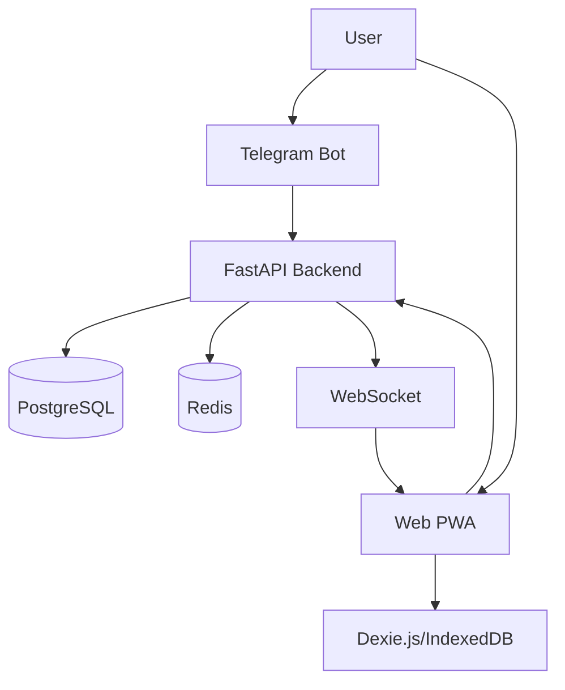
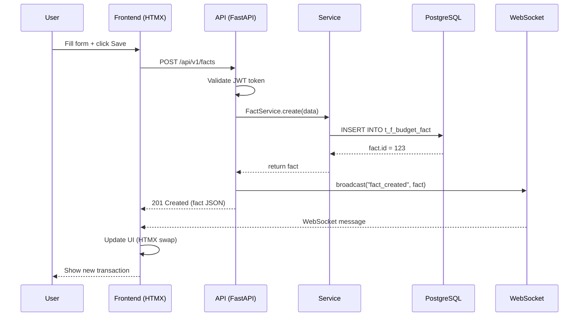

# Quick Start Tour - 5 Minutes Overview

Быстрое введение в архитектуру Family Budget для новых разработчиков.

---

## Tour Structure (5 minutes)

### Section 1: Tech Stack (1 min)

**What we use:**
```
Backend:  FastAPI 0.121.2 + PostgreSQL 16 + SQLAlchemy 2.0
Frontend: HTMX + Tailwind CSS + DaisyUI + TypeScript
Bot:      python-telegram-bot 21.10 + Telegram Web Apps
Offline:  Dexie.js 4.0+ (IndexedDB wrapper)
Deploy:   Docker Compose + GitHub Actions CI/CD
```

**Why these choices:**
- FastAPI: Async support, automatic OpenAPI docs, type hints
- PostgreSQL: ACID compliance, advanced features (ARRAY, JSON, full-text search)
- HTMX: Hypermedia approach, no build step, progressive enhancement
- Dexie.js: Offline-first, IndexedDB abstraction, sync queue

**Visualization:**


---

### Section 2: Key Patterns (2 min)

#### Pattern 1: SCD Type 2 (Dimension Tables)

**Что это:**
- Slowly Changing Dimensions Type 2
- Сохранение истории изменений справочников
- Стабильные FK references

**Example:**
```python
# Article renamed "Food" → "Groceries"
# OLD record (closed):
Article(id=1, name="Food", is_current=False, valid_to=2026-02-09)

# NEW record (active):
Article(id=1, name="Groceries", is_current=True, valid_from=2026-02-09)

# BudgetFact.article_id=1 всегда валиден!
```

**Where used:**
- `t_d_article` (budget categories)
- `t_d_financial_center` (accounts)
- `t_d_cost_center` (cost centers)

---

#### Pattern 2: Closure Table (Article Hierarchy)

**Что это:**
- Хранение всех путей в иерархии
- O(1) query для "все дочерние категории"

**Example:**
```sql
-- Hierarchy:
--   Food (1)
--     ├─ Groceries (2)
--     └─ Restaurants (3)
--         └─ Fast Food (4)

-- Closure Table (t_d_article_hierarchy):
ancestor | descendant | depth
---------|------------|------
1        | 1          | 0       -- Food → Food (self)
1        | 2          | 1       -- Food → Groceries
1        | 3          | 1       -- Food → Restaurants
1        | 4          | 2       -- Food → Fast Food
2        | 2          | 0       -- Groceries → Groceries
3        | 3          | 0       -- Restaurants → Restaurants
3        | 4          | 1       -- Restaurants → Fast Food
4        | 4          | 0       -- Fast Food → Fast Food

-- Query "all children of Food":
SELECT descendant FROM t_d_article_hierarchy WHERE ancestor = 1;
-- Returns: 1, 2, 3, 4
```

**Where used:**
- `t_d_article_hierarchy` (category tree)

---

#### Pattern 3: Shared Family Budget

**Что это:**
- NO user_id filtering в fact tables
- Все члены семьи видят все транзакции
- Admin-only для управления справочниками

**Example:**
```python
# ✅ CORRECT - Fact table: NO user filter
facts = session.query(BudgetFact).all()  # All users see all

# ✅ CORRECT - Dimension CREATE: Admin only
if not current_user.is_admin:
    raise HTTPException(403, "Only admins can create categories")

# ❌ WRONG - User isolation breaks shared budget!
facts = session.query(BudgetFact).filter_by(user_id=current_user.id)
```

**Where enforced:**
- All fact tables (`t_f_budget_fact`, `t_f_shopping_list`)
- Dimension CREATE/UPDATE/DELETE (admin-only)

---

### Section 3: Directory Structure (1 min)

```
familyBudget/
├── backend/                    # FastAPI backend
│   ├── app/
│   │   ├── api/v1/endpoints/  # REST API routes
│   │   ├── models/            # SQLAlchemy models
│   │   ├── schemas/           # Pydantic schemas
│   │   ├── services/          # Business logic
│   │   └── websocket.py       # WebSocket manager
│   ├── db/migrations/         # Alembic migrations
│   └── tests/                 # Pytest tests
├── frontend/
│   ├── web/
│   │   ├── static/js/         # TypeScript modules
│   │   └── templates/         # Jinja2 + HTMX
│   └── telegram_bot/          # Telegram bot
├── docs/
│   ├── architecture/          # Architecture docs (100 files)
│   └── diagrams/              # Mermaid diagrams (10 files)
└── .claude/skills/            # Claude Code skills
```

**Key files to know:**
- `backend/app/main.py` - FastAPI app entry point
- `backend/app/api/v1/router.py` - API router registration
- `frontend/web/static/js/budgetWSClient.js` - WebSocket client
- `frontend/web/templates/base.html` - Base Jinja2 template

---

### Section 4: Basic Data Flow (1 min)

**Example: User creates transaction**

```
1. User fills form in frontend/web/templates/facts/modal.html
   ↓ hx-post="/api/v1/facts"

2. HTMX sends POST to backend/app/api/v1/endpoints/facts.py
   ↓ POST /facts (auth: JWT)

3. Endpoint calls backend/app/services/fact_service.py
   ↓ FactService.create(data)

4. Service creates BudgetFact model
   ↓ session.add(fact)

5. SQLAlchemy inserts to PostgreSQL
   ↓ INSERT INTO t_f_budget_fact

6. WebSocket broadcasts event
   ↓ BudgetConnectionManager.broadcast("fact_created")

7. Frontend receives WebSocket message
   ↓ budgetWSClient.handleEvent()

8. UI updates (HTMX swap or JS manipulation)
   ↓ User sees new transaction immediately
```

**Mermaid Sequence Diagram:**


---

## Tour Execution

**Command:**
```bash
@skill:doc-explorer --quick-start
```

**Interactive elements:**
1. **Welcome message** with project description
2. **Tech stack visualization** (Mermaid diagram)
3. **Pattern explanations** (SCD Type 2, Closure Table, Shared Budget)
4. **Directory tour** (tree structure + key files)
5. **Data flow walkthrough** (sequence diagram + code links)
6. **Next steps** (recommended learning paths)

**Output example:**
```
🎓 Welcome to Family Budget Quick Start Tour!

This 5-minute tour covers:
  ✓ Tech stack (FastAPI, PostgreSQL, HTMX)
  ✓ Key patterns (SCD Type 2, Closure Table, Shared Budget)
  ✓ Directory structure
  ✓ Basic data flow

───────────────────────────────────────
📚 Section 1: Tech Stack (1 min)

[Mermaid diagram: System Overview]

We use:
  • Backend: FastAPI 0.121.2 + PostgreSQL 16
  • Frontend: HTMX + Tailwind CSS + TypeScript
  • Offline: Dexie.js 4.0+
  • Deploy: Docker Compose

Why? [Links to architecture docs]

───────────────────────────────────────
🎯 Section 2: Key Patterns (2 min)

Pattern 1: SCD Type 2
[Explanation + code example]

Pattern 2: Closure Table
[SQL example + query demonstration]

Pattern 3: Shared Family Budget
[Code comparison: correct vs wrong]

───────────────────────────────────────
📁 Section 3: Directory Structure (1 min)

[Tree structure]

Key files you should know:
  1. backend/app/main.py - Entry point
  2. backend/app/api/v1/router.py - API routes
  [Links to files]

───────────────────────────────────────
🔄 Section 4: Basic Data Flow (1 min)

Example: Creating a transaction

[Sequence diagram]

[Step-by-step walkthrough with code snippets]

───────────────────────────────────────
🎉 Tour Complete!

You now understand:
  ✓ Tech stack and architecture
  ✓ Core patterns (SCD Type 2, Closure Table, Shared Budget)
  ✓ Project structure
  ✓ Basic data flow

📖 Next Steps:
  1. Choose a learning path:
     • Backend Developer (30 min)
     • Frontend Developer (25 min)
     • Full-Stack Onboarding (60 min)

  2. Deep dive into a feature:
     • Transfers (transfer deduplication)
     • Recurring Plans (MMDD encoding)
     • Offline Sync (Dexie.js)

  3. Take the Architecture Quiz (10 min)
     • Test your understanding
     • Get personalized recommendations

Would you like to:
  [a] Choose a learning path
  [b] Deep dive into a feature
  [c] Take the quiz
  [d] Exit tour
```

---

## Success Metrics

**Tour is successful if learner can answer:**
1. What tech stack does Family Budget use?
2. What is SCD Type 2 and where is it used?
3. How does Closure Table work?
4. What is Shared Family Budget model?
5. Describe the flow when user creates transaction

**Expected outcomes:**
- ✅ Understand high-level architecture
- ✅ Know key files and directories
- ✅ Ready for detailed learning paths
- ✅ Can navigate codebase with context

**Time:** 5 minutes ± 2 minutes (depending on reading speed)
