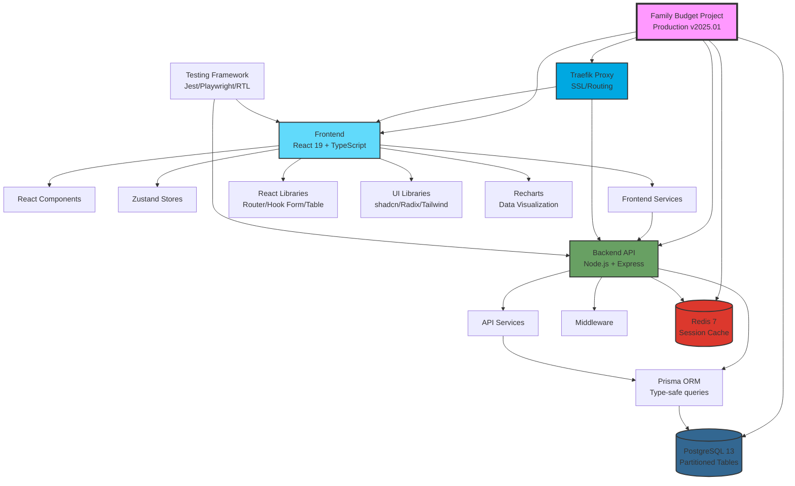
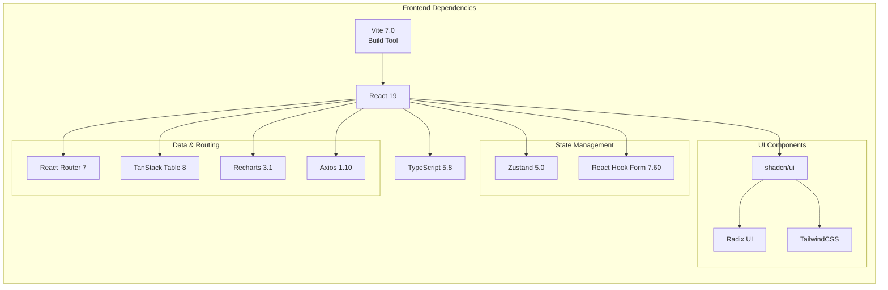
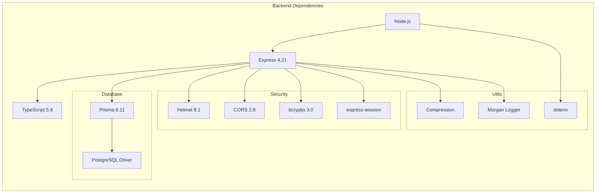
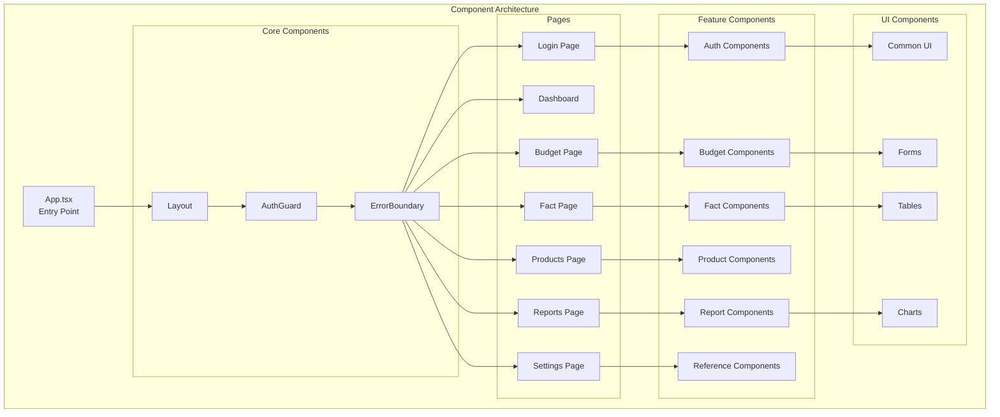
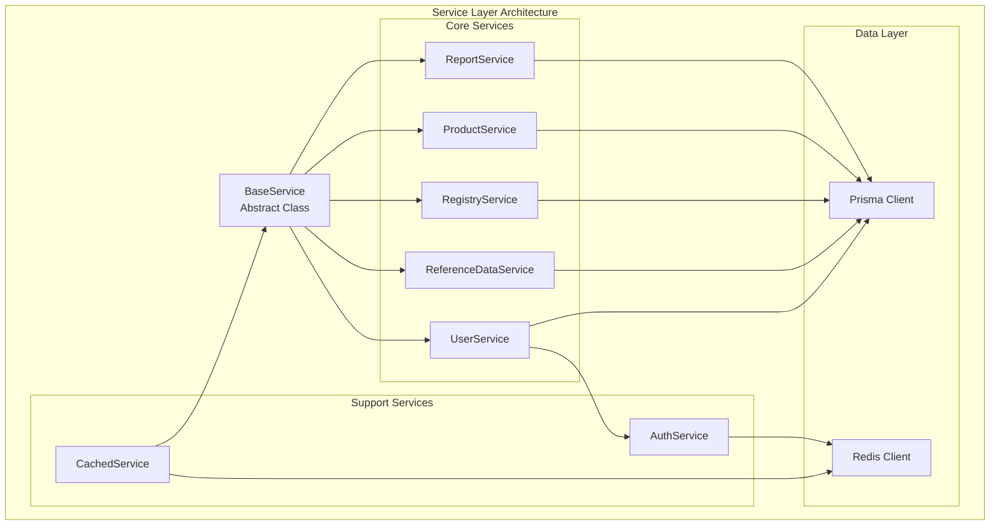
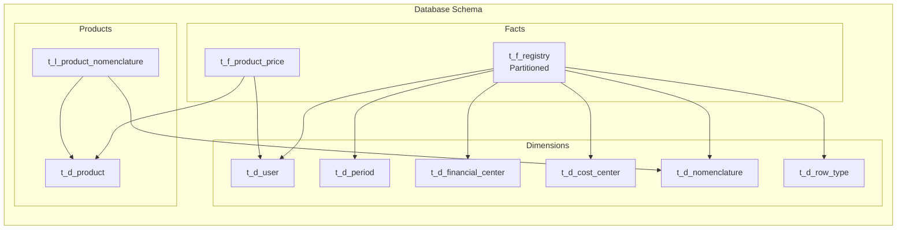

# Family Budget - Карта зависимостей проекта

## Обзор архитектуры

Family Budget представляет собой микросервисную систему управления семейным бюджетом с четким разделением компонентов и зависимостей.

## Визуальная карта зависимостей



## Детальная карта зависимостей

### 1. Frontend зависимости



### 2. Backend зависимости



### 3. Компонентная архитектура



### 4. Сервисная архитектура



### 5. База данных - схема зависимостей



## Технологические зависимости

### Frontend технологии
| Технология | Версия | Назначение |
|------------|--------|------------|
| React | 19.1.0 | UI фреймворк |
| TypeScript | 5.8.3 | Типизация |
| Vite | 7.0.0 | Сборщик |
| Zustand | 5.0.6 | State management |
| React Router | 7.6.3 | Маршрутизация |
| TanStack Table | 8.21.3 | Таблицы данных |
| Recharts | 3.1.0 | Графики |
| TailwindCSS | 3.4.17 | Стилизация |
| shadcn/ui | latest | UI компоненты |

### Backend технологии
| Технология | Версия | Назначение |
|------------|--------|------------|
| Node.js | 18+ | Runtime |
| Express | 4.21.2 | Web framework |
| Prisma | 6.11.1 | ORM |
| TypeScript | 5.8.3 | Типизация |
| bcryptjs | 3.0.2 | Хеширование |
| Helmet | 8.1.0 | Безопасность |
| express-session | 1.18.1 | Сессии |

### Инфраструктура
| Технология | Версия | Назначение |
|------------|--------|------------|
| PostgreSQL | 13 | База данных |
| Redis | 7-alpine | Кэш |
| Docker | latest | Контейнеризация |
| Docker Compose | latest | Оркестрация |
| Traefik | latest | Reverse proxy |
| Nginx | latest | Web server |

## Сетевая архитектура

```
Internet
    ↓
[Traefik :443/:80]
    ├─→ [Frontend :80] → Static files (Nginx)
    └─→ [Backend API :4000] → REST API
            ├─→ [PostgreSQL :5432] → Data storage
            └─→ [Redis :6379] → Session cache

Docker Network: app_network (10.5.0.0/24)
- Traefik: 10.5.0.1
- PostgreSQL: 10.5.0.2  
- Redis: 10.5.0.7
- Frontend: dynamic
- Backend API: dynamic
```

## NPM зависимости

### Frontend (91 packages)
- **Production**: 33 основных зависимостей
- **Development**: 36 dev зависимостей
- **Peer**: 22 peer зависимости

### Backend (36 packages)
- **Production**: 12 основных зависимостей
- **Development**: 13 dev зависимостей
- **Prisma generated**: 11 автогенерированных модулей

## Критические зависимости

⚠️ **Критические для работы системы:**
1. PostgreSQL - основное хранилище данных
2. Prisma ORM - управление схемой БД
3. Redis - хранение сессий
4. Traefik - SSL и маршрутизация

⚠️ **Важные для разработки:**
1. TypeScript - типобезопасность
2. Vite - сборка frontend
3. Jest/Playwright - тестирование
4. Docker Compose - локальная разработка

## Обновление зависимостей

Рекомендуемая частота обновления:
- **Security patches**: немедленно
- **Minor updates**: ежемесячно
- **Major updates**: квартально с тестированием

## Заключение

Проект Family Budget имеет хорошо структурированную архитектуру с четким разделением зависимостей. Микросервисный подход обеспечивает масштабируемость и поддерживаемость системы.

---
*Документ сгенерирован: 2025-08-21*
*Версия проекта: Production Ready (January 2025)*