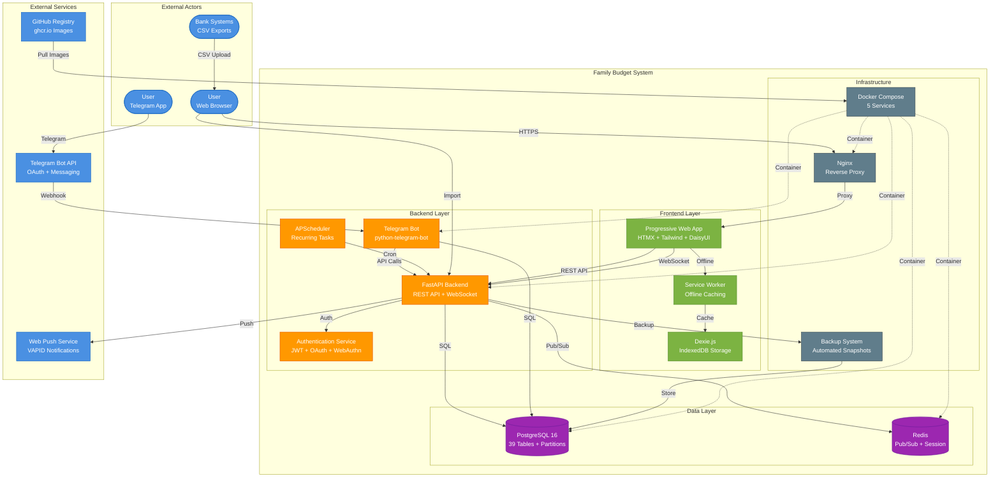

# System Architecture Overview

**Type**: C4 Context Diagram
**Purpose**: High-level view of Family Budget system components and external integrations
**Last Updated**: 2026-02-07

## System Context

## Component Descriptions

### Frontend Layer
- **Progressive Web App**: HTMX-based SPA with Tailwind CSS + DaisyUI styling
- **Service Worker**: Offline-first caching strategy (cache-first for static, network-first for API)
- **Dexie.js**: IndexedDB wrapper for offline data storage and sync queue

### Backend Layer
- **FastAPI Backend**: Async REST API + WebSocket server (Python 3.11)
- **Authentication Service**: Multi-method auth (Telegram OAuth, Email+Password+2FA, WebAuthn)
- **Telegram Bot**: Command-based bot with Web Apps integration
- **APScheduler**: Daily recurring payment processing and cleanup tasks

### Data Layer
- **PostgreSQL 16**: 39 tables with Star Schema, SCD Type 2 history, 96 monthly partitions
- **Redis**: Pub/Sub for WebSocket broadcasting + session storage

### Infrastructure
- **Docker Compose**: 5 containerized services (app, bot, postgres, redis, nginx)
- **Nginx**: Reverse proxy with SSL termination and static file serving
- **Backup System**: Automated PostgreSQL snapshots with retention policy

## Communication Protocols

| Protocol | Usage | Port |
|----------|-------|------|
| HTTPS | User → Nginx → PWA | 443 |
| WebSocket | PWA ↔ API (real-time updates) | 443/ws |
| HTTP/2 | API ↔ PostgreSQL | 5432 |
| Redis Protocol | API ↔ Redis | 6379 |
| Telegram Bot API | Bot ↔ Telegram | HTTPS |
| Web Push Protocol | API → User Browser | HTTPS |

## Data Flows

### Primary Flows
1. **Transaction Creation**: User → PWA → API → PostgreSQL → Redis Pub/Sub → WebSocket → All Clients
2. **Offline Sync**: Dexie.js Queue → Sync Manager → API → Conflict Resolution → PostgreSQL
3. **Telegram Bot**: User → Telegram → Bot → API → PostgreSQL → Response
4. **Recurring Payments**: Scheduler → API → PostgreSQL → Notifications

## Security Layers

- **Authentication**: JWT tokens (7 days access + 30 days refresh) with rotation
- **Authorization**: User/Family/Admin roles with row-level security
- **Rate Limiting**: 5 attempts/minute per endpoint
- **Partition Pruning**: Mandatory fact_date filter for queries
- **HTTPS Only**: All external communication encrypted

## Scalability Considerations

- **Horizontal Scaling**: Stateless API allows multiple instances behind load balancer
- **Database Partitioning**: 96 monthly partitions reduce query cost
- **Redis Caching**: Session and frequently accessed data cached
- **Offline-First**: Reduces server load with client-side caching
- **WebSocket Fanout**: Redis Pub/Sub enables multi-instance WebSocket broadcasting

## References

- [Authentication Architecture](../architecture/core/authentication.md)
- [Database Schema](../architecture/backend/database/)
- [Offline Architecture](09-offline-architecture.md)
- [CI/CD Pipeline](07-cicd-pipeline.md)

---

**Version**: 11.4.4
**Created**: 2026-02-07
