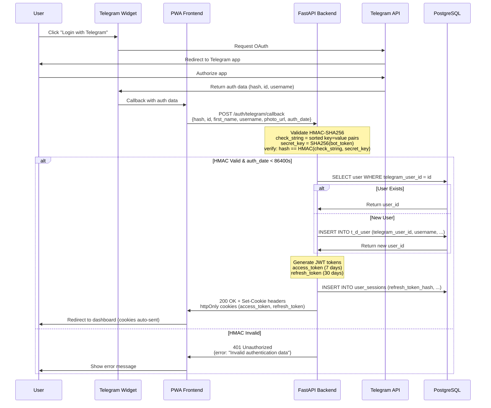
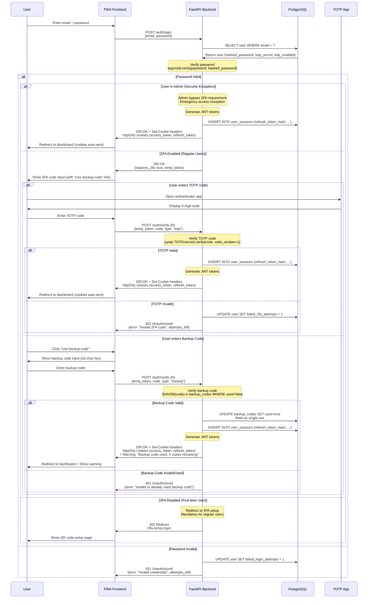
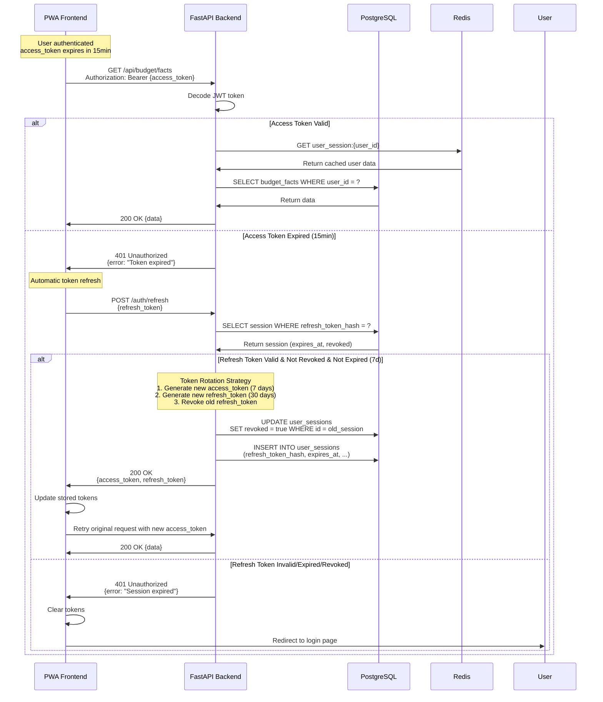
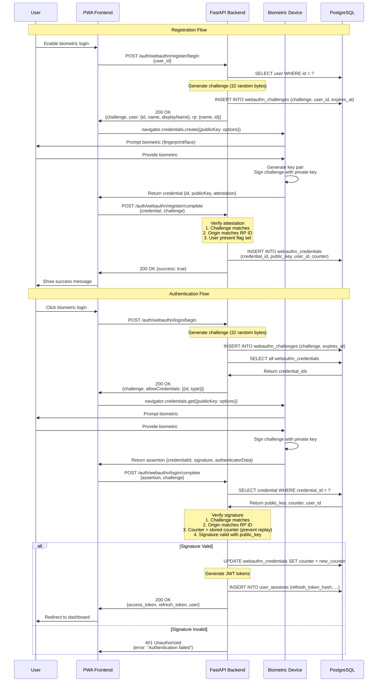

# Authentication Flows

**Type**: Sequence Diagrams
**Purpose**: Visual representation of all authentication methods in Family Budget
**Last Updated**: 2026-02-07

## Overview

Family Budget supports 4 authentication methods:
1. Telegram OAuth (HMAC-SHA256 validation)
2. Email + Password + 2FA (TOTP) - **Mandatory for regular users**
3. Email + Password (Admin Only) - **Security exception for emergency access**
4. JWT Token Lifecycle (access + refresh rotation)
5. WebAuthn Biometric Authentication

**Note**: Admin users can bypass 2FA requirement for emergency access, but 2FA is strongly recommended.

---

## 1. Telegram OAuth Flow

### Security Notes
- **HMAC Validation**: Prevents tampering with auth data
- **86400s Timeout**: Auth data expires after 24 hours
- **Secret Key**: Derived from bot token via SHA256
- **No Password**: Telegram handles user authentication

---

## 2. Email + Password + 2FA Flow

### Security Notes
- **Argon2id Hashing**: Password stored with memory-hard parameters (OWASP 2023)
- **TOTP (RFC 6238)**: Time-based one-time password with 30s window
- **Mandatory 2FA**: Required for all regular users (enforced at login)
- **Admin Bypass**: Admins can skip 2FA for emergency access (security exception)
- **Rate Limiting**: 5 failed attempts → 15min lockout
- **Backup Codes**: 10 single-use codes generated on 2FA setup

### Backup Codes (2FA Recovery)

**Purpose**: Allow account recovery when TOTP device is unavailable (lost phone, reset authenticator app)

**Generation** (during 2FA setup):
1. Generate 10 random codes (16-character hexadecimal)
2. Hash with SHA256 before storing (prevent exposure if DB compromised)
3. Display plaintext codes to user ONCE
4. User must save codes securely (password manager, printed copy)

**Format**: `a3f9d2c1b4e8f7a6` (example)

**Usage**:
- Click "Use backup code" link on 2FA verification page
- Enter any unused backup code
- Code is marked as `used=true` in database (single-use only)
- User receives warning: "Backup code used, X codes remaining"

**Security Properties**:
- **Single-use**: Each code can only be used once
- **Hashed storage**: SHA256 hash stored, not plaintext
- **Limited quantity**: Only 10 codes generated
- **Regeneration**: User can regenerate new set (invalidates old codes)

**Best Practices**:
- Store codes in password manager or encrypted file
- Print codes and store in secure physical location
- Do NOT share codes or store in plain text
- Regenerate codes after use if device is recovered

---

## 3. JWT Token Lifecycle

### Token Specifications

| Token Type | Lifetime | Storage | Rotation |
|------------|----------|---------|----------|
| Access Token | 7 days | httpOnly cookies | No rotation |
| Refresh Token | 30 days | httpOnly cookies + DB (hashed) | Rotated on refresh |

### Security Notes
- **Token Rotation**: Each refresh generates new refresh_token, old one revoked
- **Refresh Token Hashing**: SHA256 hash stored in DB, not plaintext
- **Automatic Refresh**: Frontend intercepts 401 errors, refreshes transparently
- **Session Revocation**: Admin can revoke all sessions for security

---

## 4. WebAuthn Biometric Authentication

### Security Notes
- **Public Key Cryptography**: Private key never leaves device
- **Challenge-Response**: Prevents replay attacks
- **Counter Validation**: Detects cloned authenticators
- **User Presence**: Requires user interaction (biometric/PIN)
- **Origin Validation**: Prevents phishing attacks

### Supported Authenticators
- **Platform**: Touch ID, Face ID, Windows Hello
- **Roaming**: YubiKey, Google Titan Key, hardware tokens

---

## Authentication Comparison

| Method | Security | UX | Setup Complexity | Offline Support |
|--------|----------|----|--------------------|-----------------|
| Telegram OAuth | High | Excellent | Low | No |
| Email + Password | Medium | Good | Low | No |
| Email + Password + 2FA | Very High | Good | Medium | No (requires TOTP app) |
| WebAuthn | Very High | Excellent | Medium | No |

## References

- [Authentication Architecture](../architecture/core/authentication.md)
- [Security Best Practices](../architecture/operations/security-best-practices.md)
- [JWT Implementation](../architecture/backend/endpoints/auth.md)

---

**Version**: 11.4.4
**Created**: 2026-02-07
