# Database Schema

**Type**: Entity Relationship Diagram
**Purpose**: Comprehensive view of PostgreSQL database schema with 39 tables
**Last Updated**: 2026-02-07

## Overview

Family Budget uses PostgreSQL 16 with:
- **39 tables** organized in 5 groups
- **Star Schema** (1 fact table + 4 dimension tables)
- **Closure Table** pattern for hierarchical categories
- **SCD Type 2** history tracking (8 history tables)
- **Table Partitioning** (96 monthly partitions on fact table)

---

## Star Schema (Core Analytics)

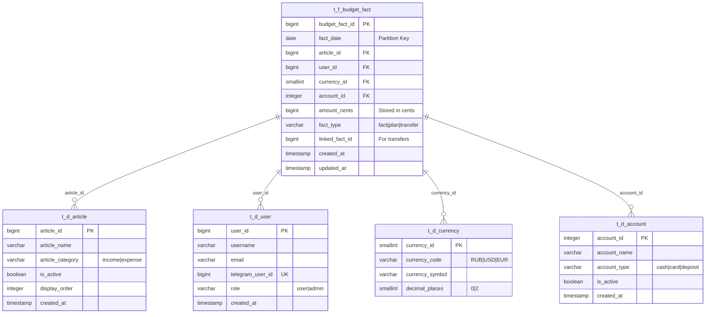

### Partition Strategy

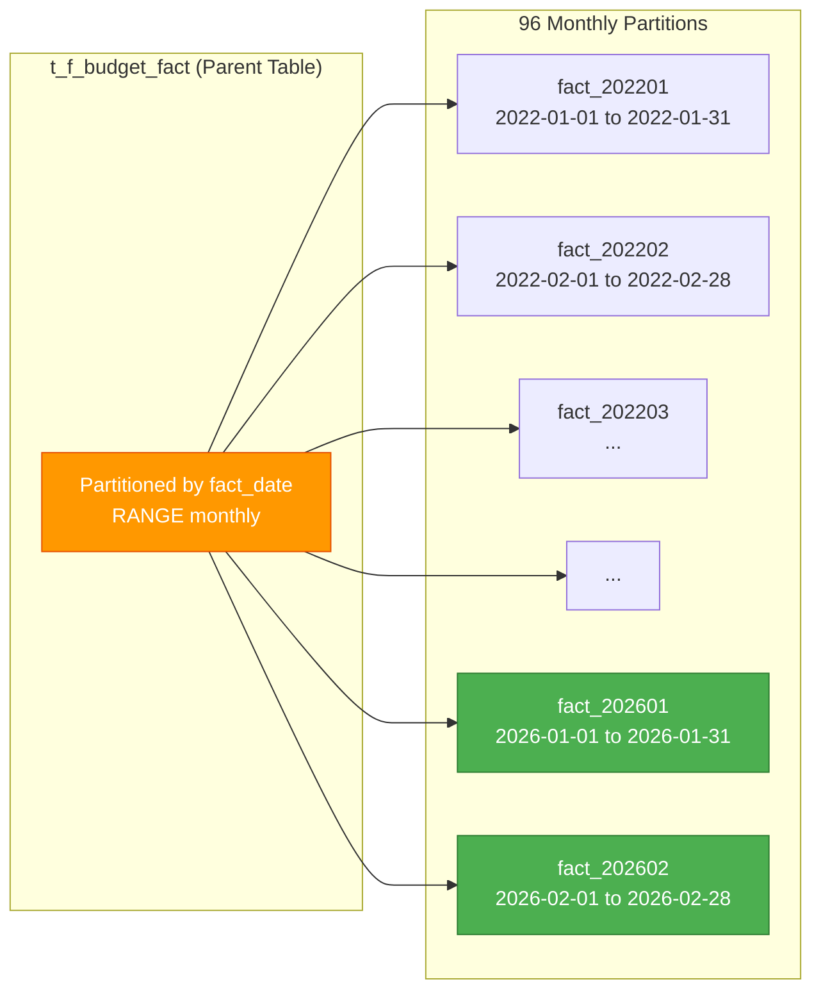

**Security Note**: Queries WITHOUT `fact_date` filter scan all 96 partitions → performance penalty enforced

---

## Closure Table Pattern (Hierarchical Categories)

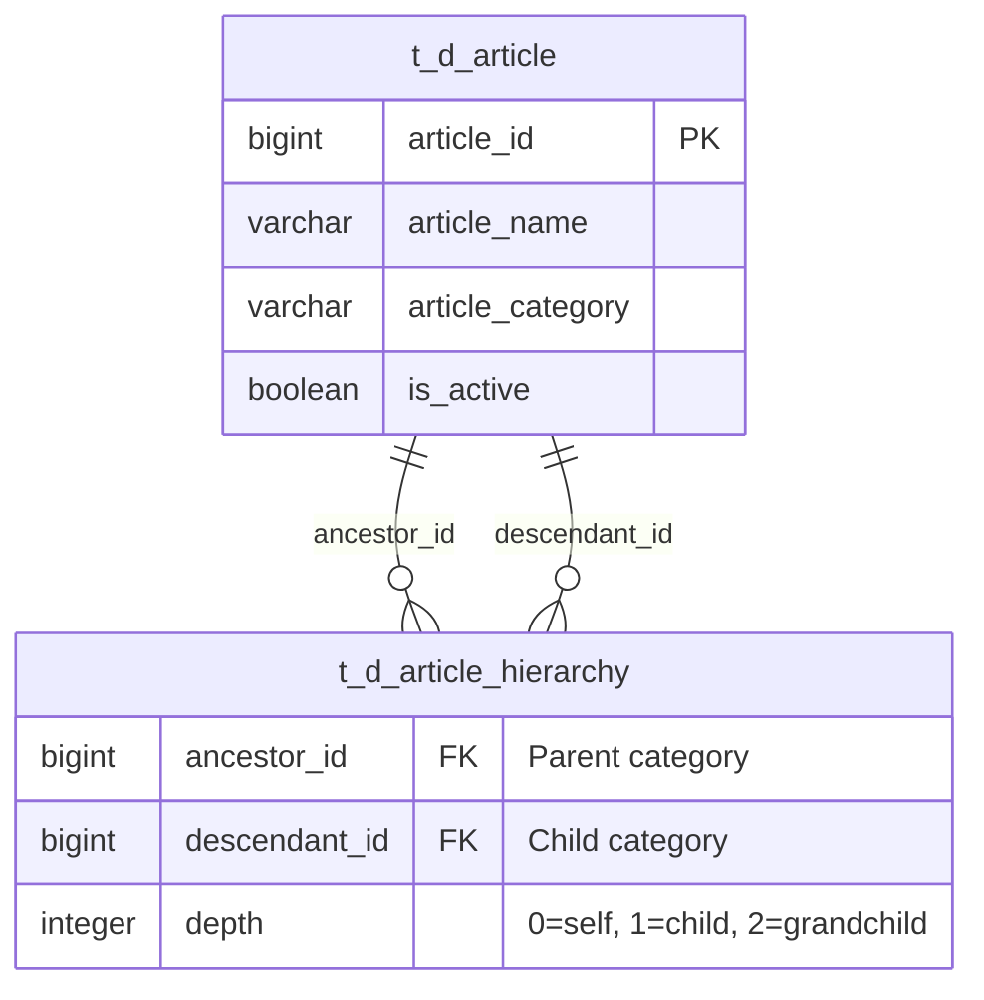

### Example Hierarchy

```
Food (ancestor_id=1)
├── Groceries (descendant_id=2, depth=1)
│   ├── Vegetables (descendant_id=3, depth=2)
│   └── Meat (descendant_id=4, depth=2)
└── Restaurants (descendant_id=5, depth=1)
```

**Closure Table Records**:
```sql
-- Self-references (depth=0)
(1,1,0), (2,2,0), (3,3,0), (4,4,0), (5,5,0)
-- Direct children (depth=1)
(1,2,1), (1,5,1), (2,3,1), (2,4,1)
-- Grandchildren (depth=2)
(1,3,2), (1,4,2)
```

**Benefits**:
- Retrieve all descendants: `SELECT * WHERE ancestor_id = 1`
- Retrieve all ancestors: `SELECT * WHERE descendant_id = 3`
- Check if ancestor: `SELECT 1 WHERE ancestor_id = 1 AND descendant_id = 3`

---

## SCD Type 2 History Tables

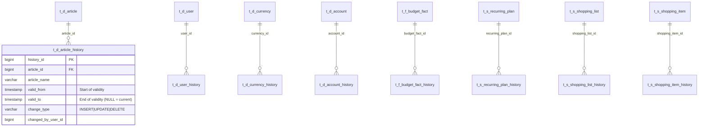

**SCD Type 2 Strategy**:
- Every change creates new history record
- `valid_from` = timestamp of change
- `valid_to` = NULL for current version, timestamp for historical
- Enables time-travel queries: "What was the category name on 2025-01-15?"

---

## Full Schema (39 Tables)

### Dimension Tables (Core)
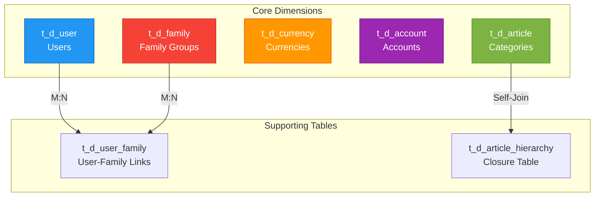

### Fact Tables
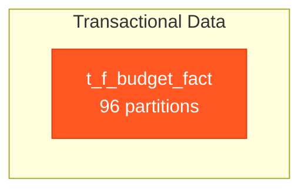

### Session & Auth Tables
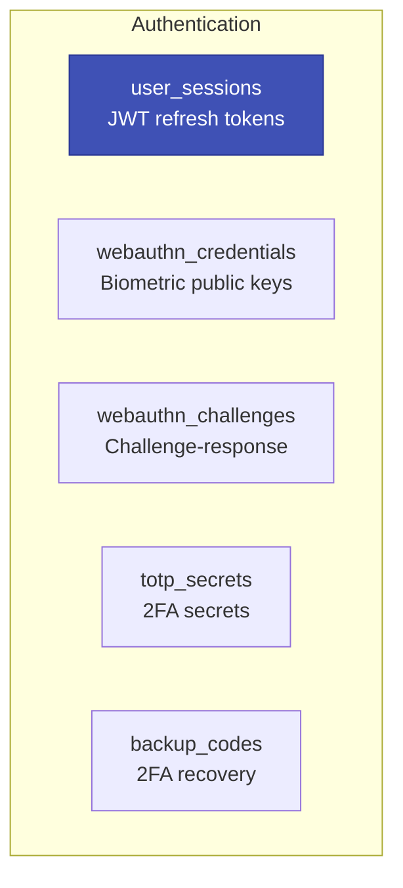

### Recurring Plans
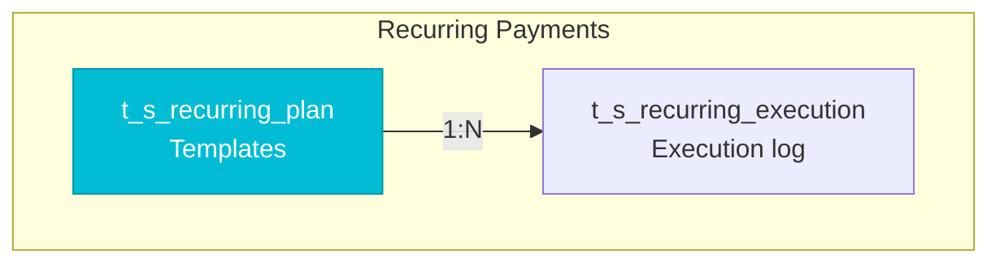

### Shopping Lists
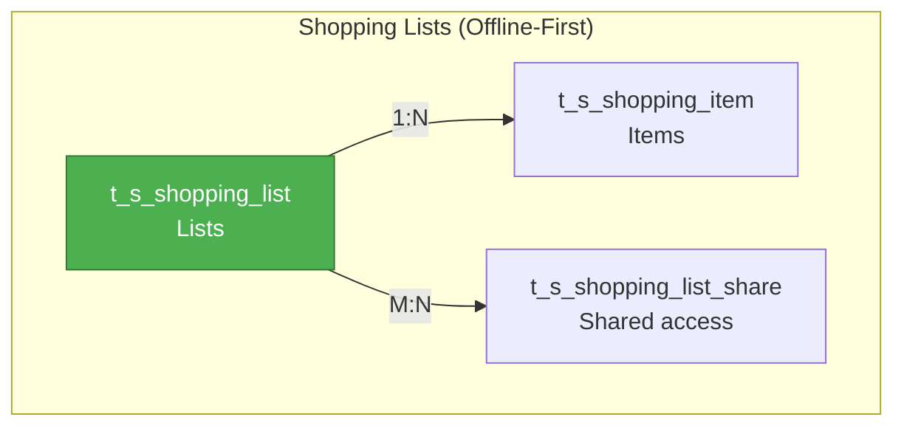

### Notifications
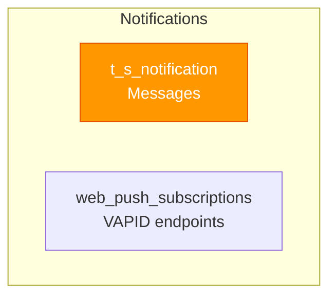

### History Tables (SCD Type 2)
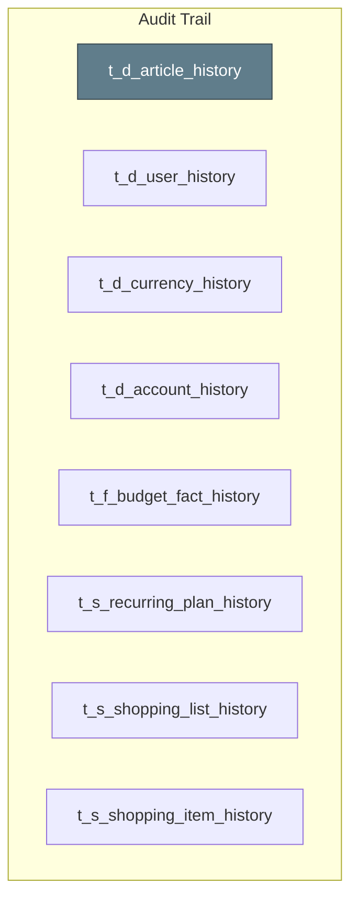

---

## Key Relationships

### User → Facts (1:N)
```sql
SELECT * FROM t_f_budget_fact WHERE user_id = 1;
```

### Article → Facts (1:N with Hierarchy)
```sql
-- All facts for "Food" category and subcategories
SELECT f.*
FROM t_f_budget_fact f
JOIN t_d_article_hierarchy h ON f.article_id = h.descendant_id
WHERE h.ancestor_id = (SELECT article_id FROM t_d_article WHERE article_name = 'Food');
```

### Transfer Facts (1:1 Linked)
```sql
-- Find transfer pair
SELECT * FROM t_f_budget_fact
WHERE budget_fact_id = 100 OR linked_fact_id = 100;
```

### Family Shared Budget (M:N)
```sql
-- All users in family
SELECT u.* FROM t_d_user u
JOIN t_d_user_family uf ON u.user_id = uf.user_id
WHERE uf.family_id = 1;
```

---

## Index Strategy

### Primary Indexes
- All `_id` columns have B-tree indexes
- Composite index on `(user_id, fact_date)` for partition pruning

### Unique Constraints
- `t_d_user.telegram_user_id` (unique per Telegram user)
- `t_d_user.email` (unique per email)
- `t_d_article_hierarchy.(ancestor_id, descendant_id)` (prevent duplicates)

### Performance Indexes
- `t_f_budget_fact.fact_date` (partition key)
- `t_f_budget_fact.linked_fact_id` (for transfer queries)
- `t_s_shopping_item.list_id` (for list fetching)

---

## Data Constraints

### Check Constraints
```sql
-- Amount must be positive
CHECK (amount_cents > 0)

-- Fact type enum
CHECK (fact_type IN ('fact', 'plan', 'transfer'))

-- Article category enum
CHECK (article_category IN ('income', 'expense'))

-- Depth must be non-negative
CHECK (depth >= 0)
```

### Foreign Key Cascade Rules
- `ON DELETE CASCADE`: user_sessions (delete sessions when user deleted)
- `ON DELETE RESTRICT`: t_f_budget_fact (prevent deleting referenced articles)
- `ON DELETE SET NULL`: t_f_budget_fact.linked_fact_id (allow unlinking transfers)

---

## Migration Strategy

### Alembic Migrations
```bash
# Generate migration
alembic revision --autogenerate -m "Add new column"

# Apply migration
python -m alembic upgrade head

# Rollback migration
python -m alembic downgrade -1
```

### Partition Maintenance
```sql
-- Create new partition for March 2026
CREATE TABLE t_f_budget_fact_202603 PARTITION OF t_f_budget_fact
FOR VALUES FROM ('2026-03-01') TO ('2026-04-01');

-- Drop old partition (archive first!)
DROP TABLE t_f_budget_fact_202201;
```

---

## Performance Characteristics

| Operation | Complexity | Notes |
|-----------|------------|-------|
| Insert fact | O(1) | Direct partition insert |
| Query by date | O(log n) | Partition pruning |
| Query without date | O(96n) | Scans all partitions |
| Closure table descendants | O(k) | k = number of descendants |
| History lookup | O(log n) | Indexed by valid_from/valid_to |

---

## References

- [Database Design](../architecture/backend/database/README.md)
- [Closure Table Pattern](../architecture/features/advanced-patterns.md)
- [SCD Type 2 Implementation](../architecture/backend/database/history-tracking.md)
- [Partition Strategy](../architecture/optimization/partition-optimization.md)

---

**Version**: 11.4.4
**Created**: 2026-02-07
