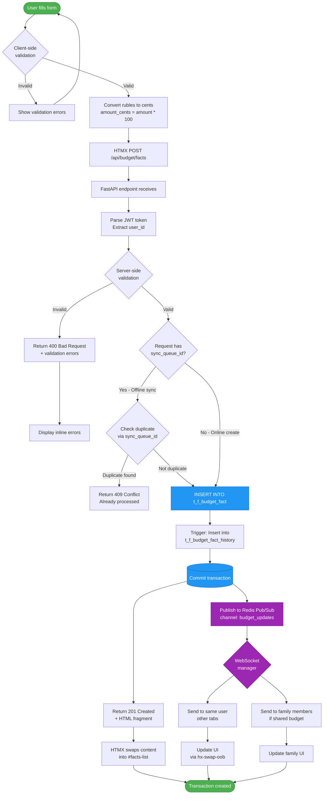
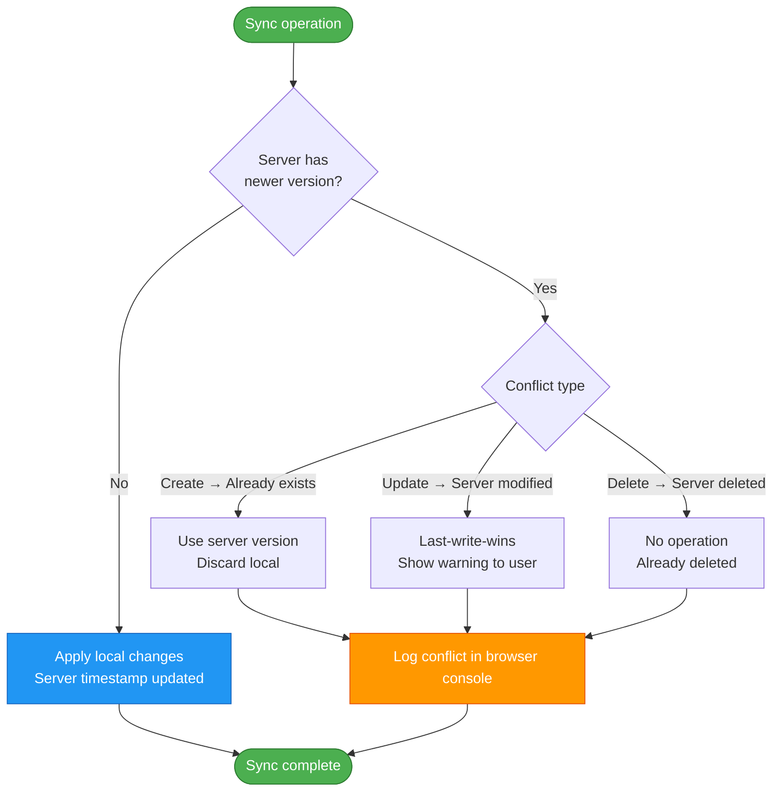
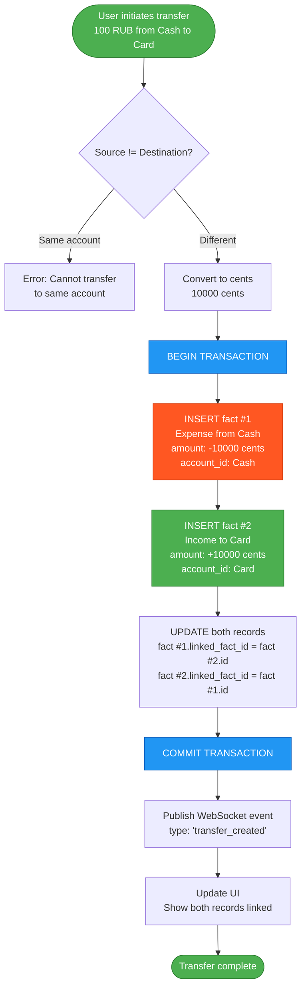
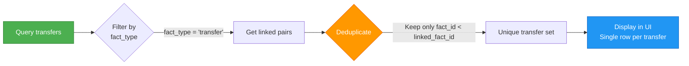
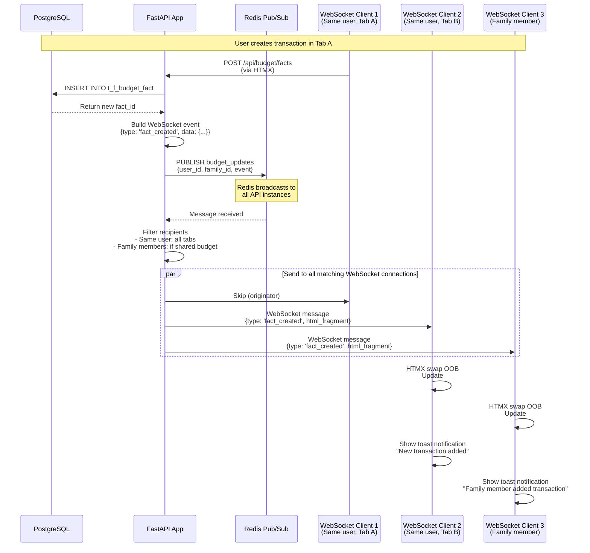
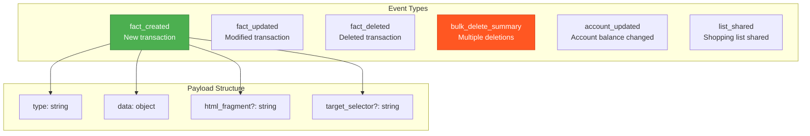
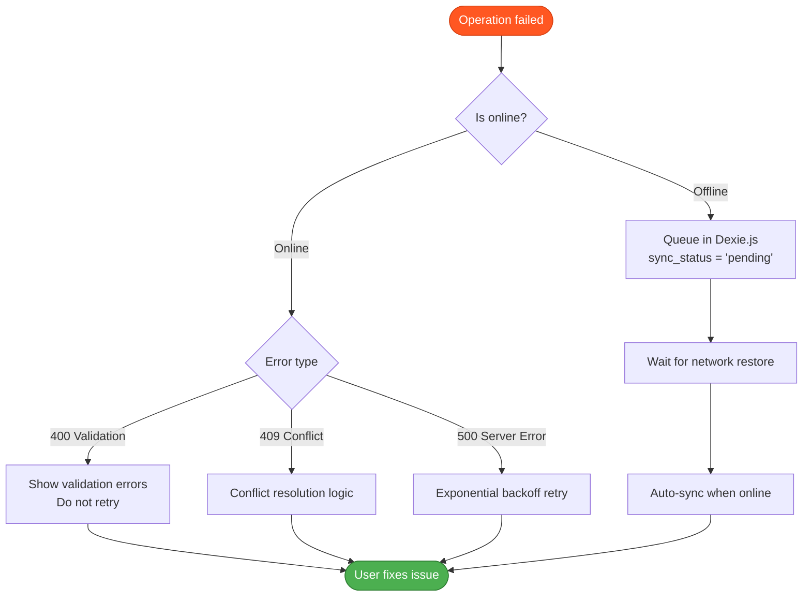

# Data Flows

**Type**: Flow Diagrams
**Purpose**: Visualize critical data flows in Family Budget system
**Last Updated**: 2026-02-07

## Overview

This document covers 4 critical data flows:
1. **Transaction Creation** - HTMX form → API → Database → WebSocket broadcast
2. **Offline Sync** - Dexie.js → Sync Manager → API → Conflict resolution
3. **Transfer Logic** - Double-entry bookkeeping with linked records
4. **WebSocket Real-Time Updates** - Database change → Redis Pub/Sub → All clients

---

## 1. Transaction Creation Flow



### Key Points
- **Cents conversion**: Frontend converts `100.50 RUB` → `10050 cents` before submission
- **Deduplication**: `sync_queue_id` prevents duplicate inserts from offline sync
- **Optimistic UI**: HTMX swaps HTML immediately, WebSocket updates other tabs
- **Family sharing**: Family members see real-time updates via WebSocket

---

## 2. Offline Sync Flow

```mermaid
stateDiagram-v2
    [*] --> Online: App loads

    Online --> Offline: Network lost<br/>(NetworkDetector)

    Offline --> QueueOperation: User creates/updates/<br/>deletes transaction
    QueueOperation --> StoreLocal: Save to Dexie.js<br/>sync_status = 'pending'
    StoreLocal --> ShowOfflineBadge: Display "Offline" badge

    ShowOfflineBadge --> Offline: Continue working
    Offline --> Online: Network restored

    Online --> CheckQueue: SyncManager checks<br/>pending operations
    CheckQueue --> HasPending{Has pending<br/>operations?}

    HasPending -->|No| [*]
    HasPending -->|Yes| ProcessQueue

    ProcessQueue --> NextItem: Get next pending item
    NextItem --> SendToAPI: POST /api/budget/facts<br/>with sync_queue_id

    SendToAPI --> APIResponse{API Response}

    APIResponse -->|201 Created| UpdateLocal1: Update Dexie.js<br/>sync_status = 'synced'
    UpdateLocal1 --> RemoveFromQueue
    RemoveFromQueue --> MoreItems{More items<br/>in queue?}

    APIResponse -->|409 Conflict<br/>Already synced| UpdateLocal2: Update Dexie.js<br/>sync_status = 'synced'
    UpdateLocal2 --> RemoveFromQueue

    APIResponse -->|400 Bad Request<br/>Validation error| MarkFailed: Update Dexie.js<br/>sync_status = 'failed'
    MarkFailed --> ShowError: Notify user<br/>of sync failure
    ShowError --> MoreItems

    APIResponse -->|500 Server Error<br/>Network error| RetryLater: Keep sync_status = 'pending'
    RetryLater --> ExponentialBackoff: Wait 2s, 4s, 8s, 16s...
    ExponentialBackoff --> MoreItems

    MoreItems -->|Yes| NextItem
    MoreItems -->|No| SyncComplete

    SyncComplete --> HideOfflineBadge: Remove "Offline" badge
    HideOfflineBadge --> [*]

    note right of StoreLocal
        Dexie.js Schema:
        {
          id: UUID,
          sync_queue_id: UUID,
          sync_status: 'pending'|'synced'|'failed',
          operation: 'create'|'update'|'delete',
          data: {...},
          created_at: timestamp,
          retry_count: 0
        }
    end note

    note right of SendToAPI
        API deduplication:
        - Check if sync_queue_id exists in DB
        - If exists, return 409 Conflict
        - If not, process normally
    end note
```

### Conflict Resolution Strategy



### Sync Status States

| State | Meaning | Action |
|-------|---------|--------|
| `pending` | Waiting to sync | Retry on network restore |
| `synced` | Successfully synced | Remove from queue |
| `failed` | Validation error | Show error to user |

---

## 3. Transfer Logic (Double-Entry Bookkeeping)



### Transfer Data Structure

```sql
-- Fact #1 (Expense)
INSERT INTO t_f_budget_fact (
    fact_date,
    article_id,     -- "Transfer Out" category
    user_id,
    currency_id,
    account_id,     -- Source account (Cash)
    amount_cents,   -- -10000 (negative)
    fact_type,      -- 'transfer'
    linked_fact_id  -- Points to Fact #2
) VALUES (
    '2026-02-07',
    (SELECT article_id FROM t_d_article WHERE article_name = 'Transfer Out'),
    1,
    1,
    5,              -- Cash account
    -10000,
    'transfer',
    2               -- Linked to Fact #2
);

-- Fact #2 (Income)
INSERT INTO t_f_budget_fact (
    fact_date,
    article_id,     -- "Transfer In" category
    user_id,
    currency_id,
    account_id,     -- Destination account (Card)
    amount_cents,   -- +10000 (positive)
    fact_type,      -- 'transfer'
    linked_fact_id  -- Points to Fact #1
) VALUES (
    '2026-02-07',
    (SELECT article_id FROM t_d_article WHERE article_name = 'Transfer In'),
    1,
    1,
    6,              -- Card account
    10000,
    'transfer',
    1               -- Linked to Fact #1
);
```

### Transfer Deduplication



**SQL Deduplication**:
```sql
-- Get unique transfers (avoid showing both sides)
SELECT *
FROM t_f_budget_fact
WHERE fact_type = 'transfer'
  AND budget_fact_id < linked_fact_id;
```

---

## 4. WebSocket Real-Time Updates



### WebSocket Event Types



### Multi-Tab Coordination

```mermaid
flowchart TB
    Start([Tab A creates transaction]) --> LocalUpdate[Update local Dexie.js]

    LocalUpdate --> BroadcastChannel[BroadcastChannel.postMessage<br/>{type: 'fact_created', id}]

    BroadcastChannel --> TabB[Tab B receives message]
    BroadcastChannel --> TabC[Tab C receives message]

    TabB --> FetchDexie1[Fetch from Dexie.js<br/>by id]
    TabC --> FetchDexie2[Fetch from Dexie.js<br/>by id]

    FetchDexie1 --> UpdateUI1[Update UI in Tab B]
    FetchDexie2 --> UpdateUI2[Update UI in Tab C]

    UpdateUI1 --> Complete([All tabs synchronized])
    UpdateUI2 --> Complete

    style Start fill:#4CAF50,stroke:#2E7D32,color:#fff
    style Complete fill:#4CAF50,stroke:#2E7D32,color:#fff
    style BroadcastChannel fill:#9C27B0,stroke:#6A1B9A,color:#fff
```

**Benefits**:
- **No redundant API calls**: Tabs share Dexie.js data
- **Instant sync**: BroadcastChannel is synchronous
- **Offline-compatible**: Works without network

---

## Performance Optimizations

### 1. Batch WebSocket Messages

```javascript
// Instead of sending 100 individual messages
for (let i = 0; i < 100; i++) {
    ws.send({type: 'fact_deleted', id: i});
}

// Send single bulk summary
ws.send({
    type: 'bulk_delete_summary',
    deleted_count: 100,
    affected_categories: ['Food', 'Transport']
});
```

### 2. Partition Pruning (Database)

```sql
-- BAD: Scans all 96 partitions
SELECT * FROM t_f_budget_fact WHERE user_id = 1;

-- GOOD: Scans only 1 partition
SELECT * FROM t_f_budget_fact
WHERE user_id = 1 AND fact_date >= '2026-02-01' AND fact_date < '2026-03-01';
```

### 3. Redis Pub/Sub Filtering

```python
# Publish with user_id and family_id
redis.publish('budget_updates', {
    'user_id': 1,
    'family_id': 5,
    'event': {...}
})

# API instance filters before sending to WebSocket
if client.user_id == event['user_id'] or client.family_id == event['family_id']:
    await client.send_json(event)
```

---

## Error Handling

### Network Failures



---

## References

- [Transaction Flow](../architecture/features/transaction-management.md)
- [Offline Architecture](09-offline-architecture.md)
- [Transfer System](../architecture/features/transfers-system.md)
- [WebSocket Implementation](../architecture/core/websocket.md)

---

**Version**: 11.4.4
**Created**: 2026-02-07
