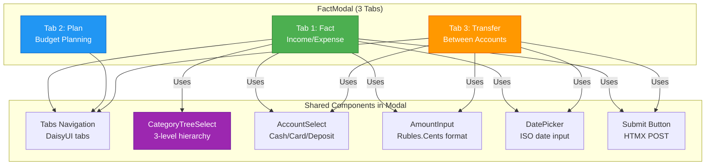
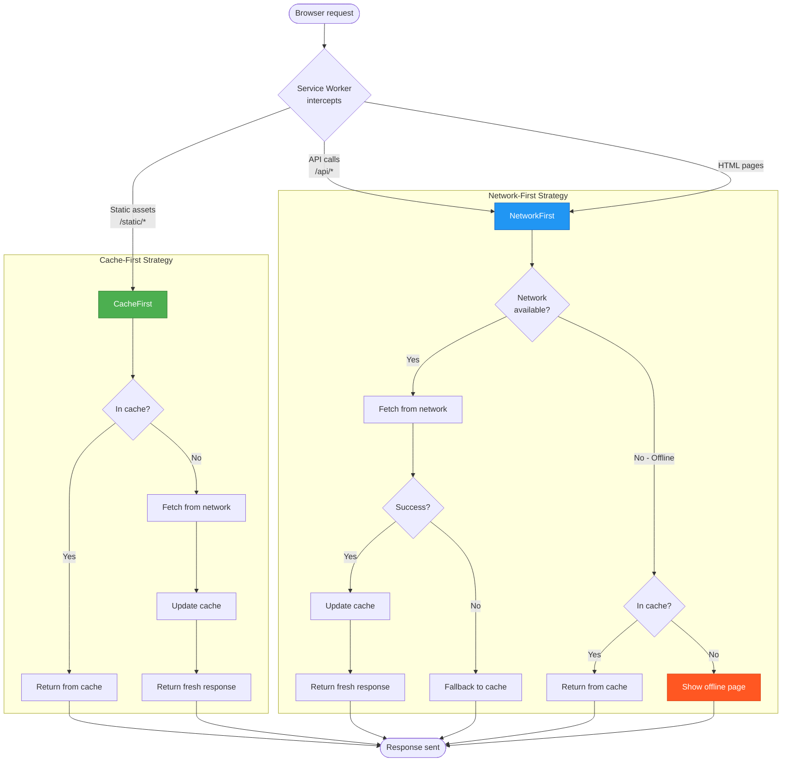
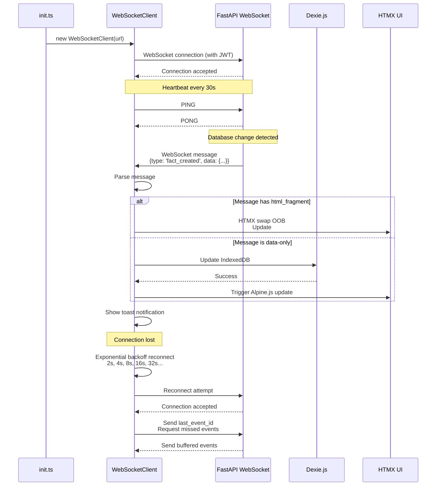
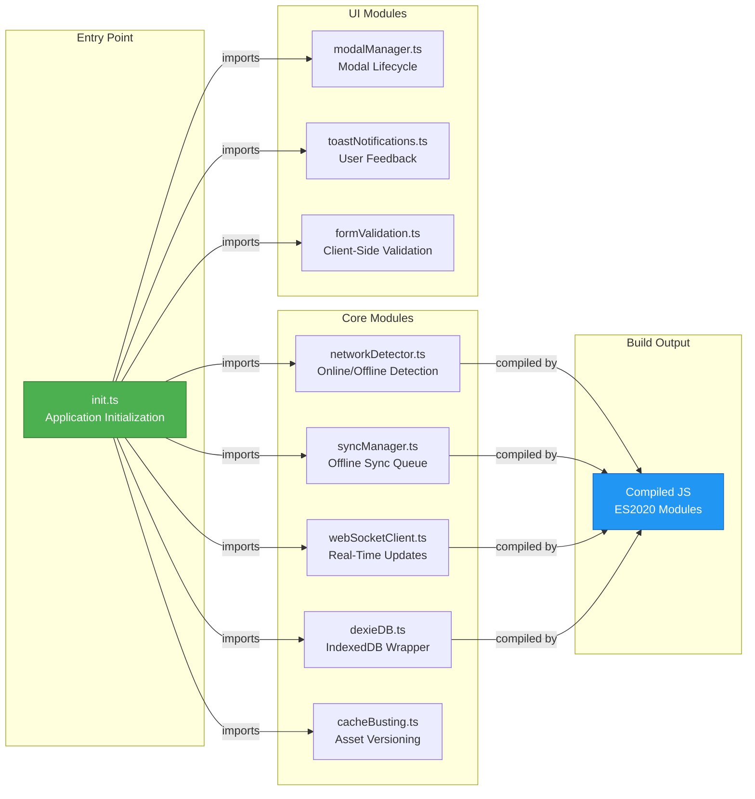

# Frontend Architecture

**Type**: Component Diagram
**Purpose**: Visual representation of Family Budget frontend architecture
**Last Updated**: 2026-02-07

## Overview

Family Budget frontend is built with:
- **HTMX** - Hypermedia-driven interactions (no React/Vue)
- **Tailwind CSS + DaisyUI** - Utility-first styling
- **TypeScript** - Type-safe frontend logic (compiled to ES modules)
- **Service Worker** - Offline-first caching
- **Dexie.js** - IndexedDB wrapper for offline storage
- **WebSocket** - Real-time updates

---

## Component Hierarchy

```mermaid
graph TB
    subgraph "Base Template (base.html)"
        BaseHTML[base.html<br>Shell HTML]
        BaseHead[Head: CSS, meta tags]
        BaseScripts[Scripts: HTMX, Alpine.js, init]
        BaseNav[Navigation bar]
        BaseFooter[Footer]
    end

    subgraph "Main Pages"
        Index[index.html<br>Dashboard]
        Facts[facts.html<br>Transactions List]
        Plan[plan.html<br>Budget Planning]
        Lists[lists.html<br>Shopping Lists]
        Analytics[analytics.html<br>Charts & Reports]
        Security[security.html<br>Auth Settings]
    end

    subgraph "Modals (Tab-Based)"
        FactModal[FactModal<br>Create/Edit Transaction]
        TransferModal[TransferModal<br>Transfer Between Accounts]
        RecurringModal[RecurringModal<br>Recurring Payment Setup]
        CategoryModal[CategoryModal<br>Category Management]
        ListItemModal[ListItemModal<br>Shopping Item]
    end

    subgraph "Reusable Components"
        CategoryTreeSelect[CategoryTreeSelect<br>Hierarchical Picker]
        AccountSelect[AccountSelect<br>Account Dropdown]
        CurrencySelect[CurrencySelect<br>Currency Picker]
        DatePicker[DatePicker<br>Date Input]
        AmountInput[AmountInput<br>Rubles + Cents]
    end

    subgraph "TypeScript Modules (ES Modules)"
        NetworkDetector[NetworkDetector<br>Online/Offline Detection]
        SyncManager[SyncManager<br>Offline Sync Queue]
        WebSocketClient[WebSocketClient<br>Real-Time Updates]
        DexieDB[DexieDB<br>IndexedDB Wrapper]
        CacheBusting[CacheBusting<br>Asset Version Management]
    end

    subgraph "Service Worker"
        SWCache[Cache Strategy<br>Static: cache-first<br>API: network-first]
        SWOffline[Offline Fallback<br>Show cached pages]
        SWSync[Background Sync<br>Queue failed requests]
    end

    BaseHTML --> BaseHead
    BaseHTML --> BaseScripts
    BaseHTML --> BaseNav
    BaseHTML --> BaseFooter

    BaseHTML -.->|Extends| Index
    BaseHTML -.->|Extends| Facts
    BaseHTML -.->|Extends| Plan
    BaseHTML -.->|Extends| Lists
    BaseHTML -.->|Extends| Analytics
    BaseHTML -.->|Extends| Security

    Facts -->|Opens| FactModal
    Facts -->|Opens| TransferModal
    Plan -->|Opens| RecurringModal
    Lists -->|Opens| ListItemModal
    Analytics -->|Opens| CategoryModal

    FactModal -->|Uses| CategoryTreeSelect
    FactModal -->|Uses| AccountSelect
    FactModal -->|Uses| CurrencySelect
    FactModal -->|Uses| DatePicker
    FactModal -->|Uses| AmountInput

    TransferModal -->|Uses| AccountSelect
    TransferModal -->|Uses| AmountInput

    BaseScripts -->|Initializes| NetworkDetector
    BaseScripts -->|Initializes| SyncManager
    BaseScripts -->|Initializes| WebSocketClient
    BaseScripts -->|Initializes| DexieDB
    BaseScripts -->|Initializes| CacheBusting

    NetworkDetector -->|Updates| SyncManager
    SyncManager -->|Reads/Writes| DexieDB
    WebSocketClient -->|Updates| DexieDB

    BaseScripts -->|Registers| SWCache
    SWCache -->|Serves| SWOffline
    SWOffline -->|Triggers| SWSync

    style BaseHTML fill:#4CAF50,stroke:#2E7D32,color:#fff
    style FactModal fill:#2196F3,stroke:#1565C0,color:#fff
    style CategoryTreeSelect fill:#FF9800,stroke:#E65100,color:#fff
    style NetworkDetector fill:#9C27B0,stroke:#6A1B9A,color:#fff
    style SWCache fill:#607D8B,stroke:#37474F,color:#fff
```



---

## Base Template Structure

```html
<!DOCTYPE html>
<html lang="ru">
<head>
    <!-- Meta tags -->
    <meta charset="UTF-8">
    <meta name="viewport" content="width=device-width, initial-scale=1.0">
    <meta name="theme-color" content="#1f2937">

    <!-- PWA manifest -->
    <link rel="manifest" href="/static/manifest.json?v={{ version }}">

    <!-- CSS (cache-busted) -->
    <link rel="stylesheet" href="/static/css/output.css?v={{ version }}">

    <!-- Preload critical resources -->
    <link rel="preload" href="/static/js/init.js?v={{ version }}" as="script">

    <title>Family Budget</title>
</head>
<body class="bg-base-200 min-h-screen">
    <!-- Navigation bar -->
    <nav class="navbar bg-primary text-primary-content">
        <div class="navbar-start">
            <a href="/" class="btn btn-ghost normal-case text-xl">💰 Family Budget</a>
        </div>
        <div class="navbar-end">
            <div id="network-status" class="badge badge-success">Online</div>
            <div class="dropdown dropdown-end">
                <label tabindex="0" class="btn btn-ghost btn-circle avatar">
                    <div class="w-10 rounded-full">
                        
                    </div>
                </label>
                <ul class="menu dropdown-content">
                    <li><a href="/security">Security</a></li>
                    <li><a href="/auth/logout">Logout</a></li>
                </ul>
            </div>
        </div>
    </nav>

    <!-- Main content -->
    <main class="container mx-auto p-4">
        
    </main>

    <!-- Footer -->
    <footer class="footer footer-center p-4 bg-base-300 text-base-content">
        <div>
            <p>Family Budget v{{ version }} | © 2026</p>
        </div>
    </footer>

    <!-- Scripts (defer for performance) -->
    <script src="https://unpkg.com/htmx.org@1.9.10"></script>
    <script src="https://unpkg.com/alpinejs@3.13.3/dist/cdn.min.js" defer></script>
    <script type="module" src="/static/js/init.js?v={{ version }}"></script>

    <!-- Service Worker registration -->
    <script>
        if ('serviceWorker' in navigator) {
            navigator.serviceWorker.register('/static/sw.js?v={{ version }}');
        }
    </script>
</body>
</html>
```

---

## Modal Architecture (Tab-Based)



### CategoryTreeSelect Component

```html
<!-- 3-level hierarchical category selector -->
<div x-data="categoryTree()" class="form-control">
    <label class="label">Category</label>

    <!-- Level 1: Main categories -->
    <select x-model="level1" @change="updateLevel2()" class="select select-bordered">
        <option value="">-- Select Category --</option>
        <template x-for="cat in categories" :key="cat.id">
            <option :value="cat.id" x-text="cat.name"></option>
        </template>
    </select>

    <!-- Level 2: Subcategories (shown if level1 selected) -->
    <select x-show="level2Options.length > 0"
            x-model="level2"
            @change="updateLevel3()"
            class="select select-bordered mt-2">
        <option value="">-- Select Subcategory --</option>
        <template x-for="cat in level2Options" :key="cat.id">
            <option :value="cat.id" x-text="cat.name"></option>
        </template>
    </select>

    <!-- Level 3: Sub-subcategories (shown if level2 selected) -->
    <select x-show="level3Options.length > 0"
            x-model="level3"
            class="select select-bordered mt-2">
        <option value="">-- Select Detail --</option>
        <template x-for="cat in level3Options" :key="cat.id">
            <option :value="cat.id" x-text="cat.name"></option>
        </template>
    </select>

    <!-- Hidden input for form submission -->
    <input type="hidden" name="article_id" :value="selectedArticleId()">
</div>
```

**Data Flow**:
1. Fetch categories from `/api/articles/tree` (closure table query)
2. Build 3-level hierarchy in Alpine.js
3. User selects level → triggers cascade update
4. Submit `article_id` (leaf node only)

---

## Service Worker Caching Strategy



### Cache Busting

```javascript
// init.ts
const VERSION = '11.4.4';

// All assets loaded with version query parameter
const script = document.createElement('script');
script.src = `/static/js/module.js?v=${VERSION}`;

// Service Worker caches by full URL (including version)
// When version changes → new cache entry → old cache pruned
```

---

## Dexie.js Schema

```javascript
// frontend/shared/db/dexie/core/database.ts
import Dexie from 'dexie';

const db = new Dexie('FamilyBudgetDB');
db.version(3).stores({
    // Reference Data (5 tables)
    articles: 'article_id, article_name, article_category, is_active',
    articleHierarchy: '[ancestor_id+descendant_id], ancestor_id, descendant_id',
    financialCenters: 'financial_center_id, name, is_active',  // NOT "accounts"!
    costCenters: 'cost_center_id, name, is_active',

    // Transactional Data (4 tables)
    budgetFacts: 'budget_fact_id, sync_queue_id, user_id, fact_date, sync_status, amount_cents',
    pendingOperations: '++id, sync_queue_id, operation, entity_type, retry_count',  // NOT "sync_queue"!
    syncConflicts: '++id, entity_type, entity_id, conflict_type, created_at',
    recurringPlans: 'recurring_plan_id, user_id, article_id, is_active',

    // Shopping Lists (5 tables)
    shoppingLists: 'shopping_list_id, sync_queue_id, creator_id, name, sync_status',
    shoppingListItems: 'shopping_item_id, sync_queue_id, list_id, name, purchased, sync_status',
    stores: 'store_id, name',  // Global reference data
    productGroups: 'product_group_id, name',  // Global reference data
    productGroupHierarchy: '[ancestor_id+descendant_id], ancestor_id, descendant_id',

    // Metadata (2 tables)
    syncMetadata: 'key, value, last_synced_at',  // NOT "preferences"!
    schemaMigrations: '++id, version, applied_at'
});
```

### IndexedDB Storage Limits

| Browser | Quota | Eviction Policy |
|---------|-------|-----------------|
| Chrome | ~60% of disk space | LRU when storage full |
| Firefox | ~50% of disk space | Prompt user at 50MB |
| Safari | 1 GB | Prompt user at 200MB |

---

## WebSocket Client Architecture



### Multi-Tab Coordination (BroadcastChannel)

```javascript
// webSocketClient.ts
const channel = new BroadcastChannel('budget_updates');

// Tab A: Creates transaction locally
dexie.budget_facts.add(fact);
channel.postMessage({ type: 'fact_created', id: fact.id });

// Tab B: Receives broadcast
channel.onmessage = async (event) => {
    if (event.data.type === 'fact_created') {
        const fact = await dexie.budget_facts.get(event.data.id);
        updateUI(fact);
    }
};
```

**Benefits**:
- **No WebSocket overhead**: Tabs communicate directly
- **Instant sync**: No network round-trip
- **Offline-compatible**: Works without server

---

## TypeScript Module System (ES Modules)



### Build Process (Vite)

```bash
# Development (watch mode)
npm run dev:ts

# Production (minified + source maps)
npm run build:ts
```

**Output**:
- `static/js/init.js` - Entry point (~5KB gzipped)
- `static/js/chunks/` - Code-split modules
- Source maps for debugging

---

## Responsive Design

```mermaid
graph TB
    subgraph "Breakpoints (Tailwind)"
        Mobile[Mobile<br>< 640px]
        Tablet[Tablet<br>640px - 1024px]
        Desktop[Desktop<br>> 1024px]
    end

    subgraph "Layout Adjustments"
        MobileLayout[Stack vertically<br>Full-width cards<br>Bottom navigation]
        TabletLayout[2-column grid<br>Sidebar navigation<br>Compact tables]
        DesktopLayout[3-column grid<br>Fixed sidebar<br>Data tables]
    end

    Mobile --> MobileLayout
    Tablet --> TabletLayout
    Desktop --> DesktopLayout

    subgraph "iOS Safari Quirks"
        ViewportFix[100vh issue<br>Use 100dvh instead]
        InputZoom[Input zoom<br>font-size >= 16px]
        SafeArea[Safe area insets<br>env(safe-area-inset-*)]
    end

    MobileLayout -.->|Fixes| ViewportFix
    MobileLayout -.->|Fixes| InputZoom
    MobileLayout -.->|Fixes| SafeArea

    style Mobile fill:#4CAF50,stroke:#2E7D32,color:#fff
    style ViewportFix fill:#FF9800,stroke:#E65100,color:#fff
```

### iOS Safari Fixes

```css
/* Fix 100vh on mobile Safari (address bar issue) */
.min-h-screen {
    min-height: 100dvh; /* Dynamic viewport height */
}

/* Prevent input zoom on iOS */
input, select, textarea {
    font-size: 16px; /* Minimum to prevent zoom */
}

/* Safe area padding for notches */
.container {
    padding-left: max(1rem, env(safe-area-inset-left));
    padding-right: max(1rem, env(safe-area-inset-right));
}
```

---

## Performance Metrics

### Bundle Sizes (Gzipped)

| Resource | Size | Load Time (3G) |
|----------|------|----------------|
| output.css | 12 KB | ~120ms |
| init.js | 5 KB | ~50ms |
| HTMX | 14 KB | ~140ms |
| Alpine.js | 15 KB | ~150ms |
| Dexie.js | 24 KB | ~240ms |
| **Total** | **70 KB** | **~700ms** |

### Lighthouse Scores (Target)

- **Performance**: 95+
- **Accessibility**: 100
- **Best Practices**: 100
- **SEO**: 100
- **PWA**: 100

---

## References

- [PWA Architecture](../architecture/core/pwa.md)
- [Dexie.js Integration](../architecture/core/dexie-integration.md)
- [Responsive Design](../architecture/frontend/responsive-design.md)
- [Modal Architecture](../architecture/frontend/modal-architecture.md)
- [Z-Index Layering](../architecture/frontend/z-index-layering.md)

---

**Version**: 11.4.4
**Created**: 2026-02-07
