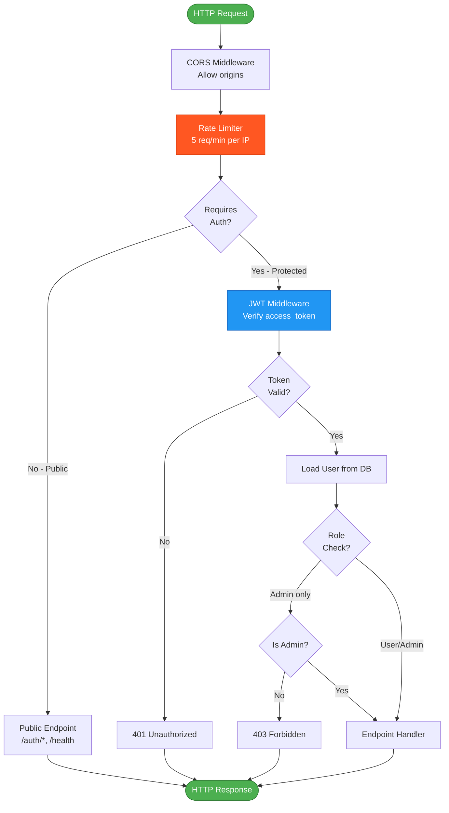
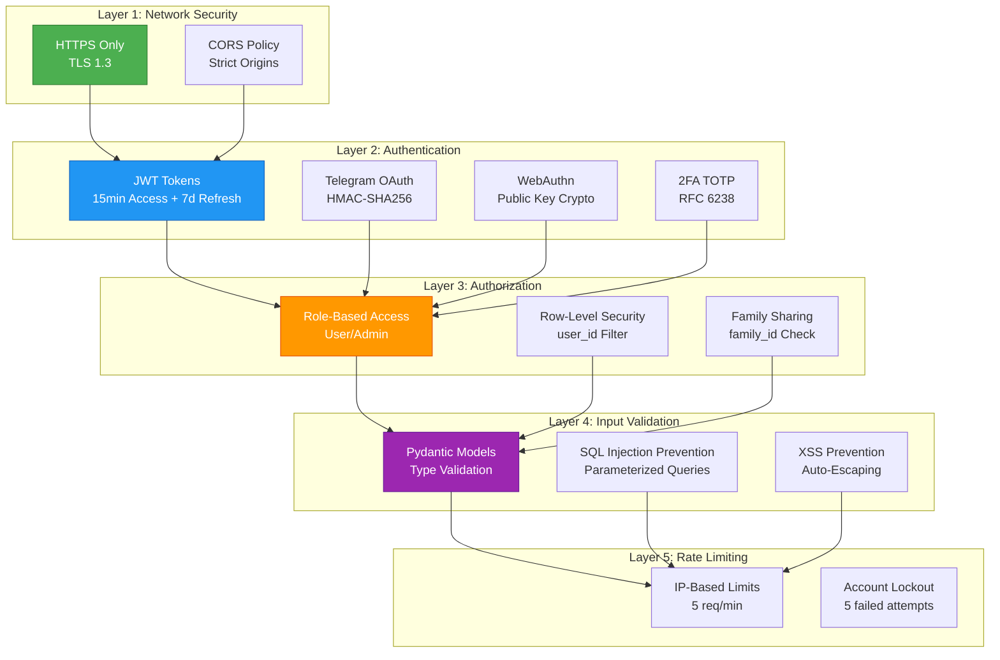

# Backend API Map

**Type**: API Architecture Diagram
**Purpose**: REST endpoints, middleware chain, security layers
**Last Updated**: 2026-02-07

## API Endpoint Map

```mermaid
graph TB
    subgraph "Authentication (/auth)"
        AuthTelegram[POST /auth/telegram/callback<br/>Telegram OAuth]
        AuthLogin[POST /auth/login<br/>Email + Password]
        Auth2FA[POST /auth/verify-2fa<br/>TOTP Verification]
        AuthRefresh[POST /auth/refresh<br/>JWT Token Refresh]
        AuthWebAuthnBegin[POST /auth/webauthn/login/begin<br/>WebAuthn Challenge]
        AuthWebAuthnComplete[POST /auth/webauthn/login/complete<br/>WebAuthn Verify]
    end

    subgraph "Budget Facts (/api/budget)"
        FactsList[GET /api/budget/facts<br/>List Transactions]
        FactCreate[POST /api/budget/facts<br/>Create Transaction]
        FactUpdate[PUT /api/budget/facts/:id<br/>Update Transaction]
        FactDelete[DELETE /api/budget/facts/:id<br/>Delete Transaction]
        FactBulkDelete[POST /api/budget/facts/bulk-delete<br/>Delete Multiple]
        TransferCreate[POST /api/budget/transfers<br/>Create Transfer]
    end

    subgraph "Categories (/api/articles)"
        ArticlesList[GET /api/articles<br/>List Categories]
        ArticlesTree[GET /api/articles/tree<br/>Hierarchical Tree]
        ArticleCreate[POST /api/articles<br/>Create Category]
        ArticleUpdate[PUT /api/articles/:id<br/>Update Category]
    end

    subgraph "Accounts (/api/accounts)"
        AccountsList[GET /api/accounts<br/>List Accounts]
        AccountCreate[POST /api/accounts<br/>Create Account]
        AccountBalance[GET /api/accounts/:id/balance<br/>Current Balance]
    end

    subgraph "Recurring Plans (/api/recurring)"
        RecurringList[GET /api/recurring/plans<br/>List Plans]
        RecurringCreate[POST /api/recurring/plans<br/>Create Plan]
        RecurringExecute[POST /api/recurring/execute<br/>Manual Execution]
    end

    subgraph "Shopping Lists (/api/lists)"
        ListsList[GET /api/lists<br/>List Shopping Lists]
        ListCreate[POST /api/lists<br/>Create List]
        ListShare[POST /api/lists/:id/share<br/>Share with User]
        ItemCreate[POST /api/lists/:id/items<br/>Add Item]
        ItemToggle[PUT /api/lists/:id/items/:item_id<br/>Toggle Purchased]
    end

    subgraph "Analytics (/api/analytics)"
        AnalyticsSummary[GET /api/analytics/summary<br/>Period Summary]
        AnalyticsCategories[GET /api/analytics/by-category<br/>Category Breakdown]
        AnalyticsTrends[GET /api/analytics/trends<br/>Time Series]
    end

    subgraph "Integration (/api/integration)"
        CSVImport[POST /api/integration/csv-import<br/>Import Bank CSV]
        BackupExport[GET /api/integration/backup<br/>Export All Data]
        BackupImport[POST /api/integration/restore<br/>Restore Backup]
    end

    subgraph "WebSocket (/ws)"
        WSConnect[GET /ws/connect<br/>Establish Connection]
    end

    style AuthTelegram fill:#4CAF50,stroke:#2E7D32,color:#fff
    style FactCreate fill:#2196F3,stroke:#1565C0,color:#fff
    style ArticlesTree fill:#FF9800,stroke:#E65100,color:#fff
    style RecurringExecute fill:#9C27B0,stroke:#6A1B9A,color:#fff
```

---

## Middleware Chain

---

## Security Layers

---

## References

- [API Documentation](../architecture/backend/endpoints/)
- [Authentication](../architecture/core/authentication.md)
- [Security Best Practices](../architecture/operations/security-best-practices.md)

---

**Version**: 11.4.4
**Created**: 2026-02-07
