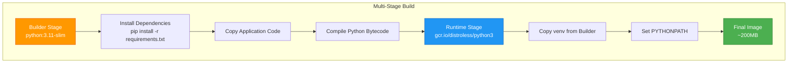

# CI/CD Pipeline

**Type**: Pipeline Flow Diagram
**Purpose**: GitHub Actions workflow from git push to production deployment
**Last Updated**: 2026-02-07

## Pipeline Overview

```mermaid
flowchart TB
    Start([git push to test branch]) --> Trigger[GitHub Actions Triggered]

    Trigger --> Checkout[Checkout Code]
    Checkout --> SetupNode[Setup Node.js 18.x]

    SetupNode --> ParallelChecks

    subgraph "Parallel Quality Checks"
        ParallelChecks[Start Parallel Jobs]
        ParallelChecks --> Lint[ESLint Check]
        ParallelChecks --> TypeCheck[TypeScript Type Check]
        ParallelChecks --> PythonTests[Backend Unit Tests<br>pytest --cov]

        Lint --> QualityGate
        TypeCheck --> QualityGate
        PythonTests --> QualityGate
        QualityGate{All Passed?}
    end

    QualityGate -->|Fail| NotifyFailure[Notify Failure]
    NotifyFailure --> End1([Pipeline Failed])

    QualityGate -->|Pass| FrontendBuild[Frontend Build]

    subgraph "Frontend Build (TypeScript + Vite)"
        FrontendBuild --> InstallDeps[npm ci]
        InstallDeps --> CompileTS[Compile TypeScript<br>ES2020 Modules]
        CompileTS --> CacheBust[Cache Busting<br>Append ?v=VERSION to assets]
        CacheBust --> MinifyCSS[Minify Tailwind CSS<br>PurgeCSS]
        MinifyCSS --> FrontendArtifact[Upload Artifact<br>static/]
    end

    FrontendArtifact --> DockerBuild

    subgraph "Docker Multi-Stage Build"
        DockerBuild[Build Docker Images]
        DockerBuild --> BuildApp[Build App Image<br>Python 3.11 + FastAPI]
        DockerBuild --> BuildBot[Build Bot Image<br>python-telegram-bot]
        DockerBuild --> BuildNginx[Build Nginx Image<br>Static files from artifact]

        BuildApp --> TagImages
        BuildBot --> TagImages
        BuildNginx --> TagImages

        TagImages[Tag Images<br>ghcr.io/user/repo:VERSION]
    end

    TagImages --> PushRegistry[Push to ghcr.io Registry]

    PushRegistry --> UpdateVersion[Update VERSION File<br>in Repository]

    UpdateVersion --> DeployTrigger{Branch?}

    DeployTrigger -->|test| DeployDev[Deploy to Development<br>fbd.ikeniborn.ru]
    DeployTrigger -->|main| DeployProd[Deploy to Production<br>fb.ikeniborn.ru]

    subgraph "Deployment Flow (Registry-First)"
        DeployDev --> SSHConnect1[SSH to Dev Server]
        DeployProd --> SSHConnect2[SSH to Prod Server]

        SSHConnect1 --> PullImages1[docker pull ghcr.io/.../app:VERSION]
        SSHConnect2 --> PullImages2[docker pull ghcr.io/.../app:VERSION]

        PullImages1 --> CheckPort1{Port 8000<br>Available?}
        PullImages2 --> CheckPort2{Port 8000<br>Available?}

        CheckPort1 -->|In Use| StopOld1[docker compose down]
        CheckPort2 -->|In Use| StopOld2[docker compose down]

        CheckPort1 -->|Available| ComposeUp1
        CheckPort2 -->|Available| ComposeUp2

        StopOld1 --> ComposeUp1[docker compose up -d]
        StopOld2 --> ComposeUp2[docker compose up -d]

        ComposeUp1 --> RunMigrations1[docker exec app<br>python -m alembic upgrade head]
        ComposeUp2 --> RunMigrations2[docker exec app<br>python -m alembic upgrade head]

        RunMigrations1 --> HealthCheck1{Health Check<br>200 OK?}
        RunMigrations2 --> HealthCheck2{Health Check<br>200 OK?}

        HealthCheck1 -->|Fail| Rollback1[Rollback to Previous]
        HealthCheck2 -->|Fail| Rollback2[Rollback to Previous]

        HealthCheck1 -->|Pass| DeploySuccess1
        HealthCheck2 -->|Pass| DeploySuccess2
    end

    DeploySuccess1([Development Deployed])
    DeploySuccess2([Production Deployed])

    Rollback1 --> End2([Deployment Failed])
    Rollback2 --> End3([Deployment Failed])

    style Start fill:#4CAF50,stroke:#2E7D32,color:#fff
    style QualityGate fill:#FF9800,stroke:#E65100,color:#fff
    style PushRegistry fill:#2196F3,stroke:#1565C0,color:#fff
    style DeploySuccess1 fill:#4CAF50,stroke:#2E7D32,color:#fff
    style DeploySuccess2 fill:#4CAF50,stroke:#2E7D32,color:#fff
    style Rollback1 fill:#FF5722,stroke:#D84315,color:#fff
```

---

## Docker Image Strategy

### 5 Docker Images

1. **app** - FastAPI backend (distroless Python 3.11)
2. **bot** - Telegram bot (distroless Python 3.11)
3. **nginx** - Reverse proxy + static files (nginx:alpine)
4. **postgres** - Database (postgres:16-alpine)
5. **redis** - Pub/Sub + sessions (redis:7-alpine)

---

## References

- [CI/CD Architecture](../architecture/operations/ci-cd-build-deploy.md)
- [Docker Configuration](../architecture/core/docker.md)
- [Deployment Troubleshooting](../architecture/operations/deployment-troubleshooting.md)

---

**Version**: 11.4.4
**Created**: 2026-02-07
