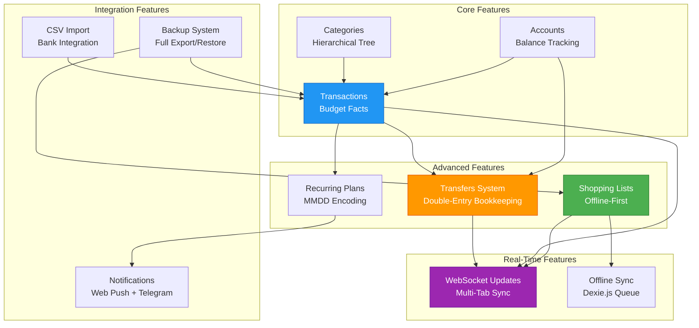
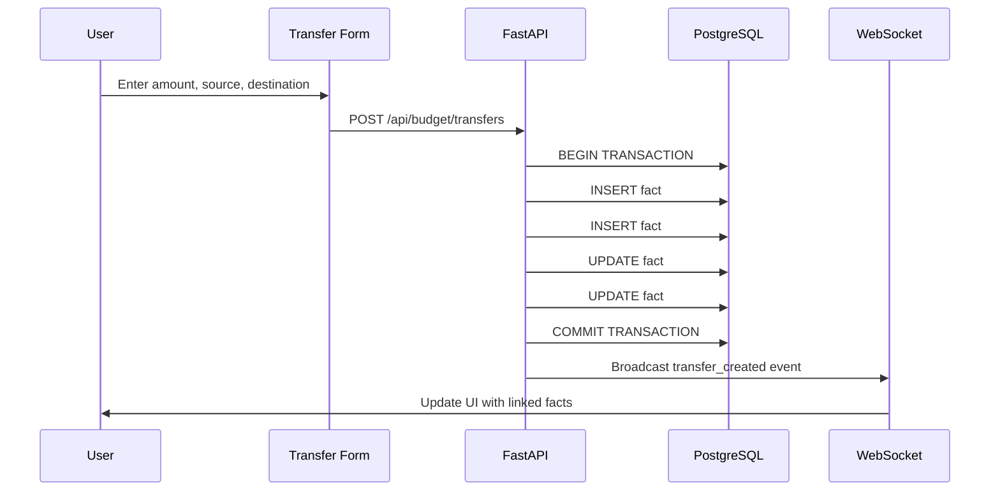
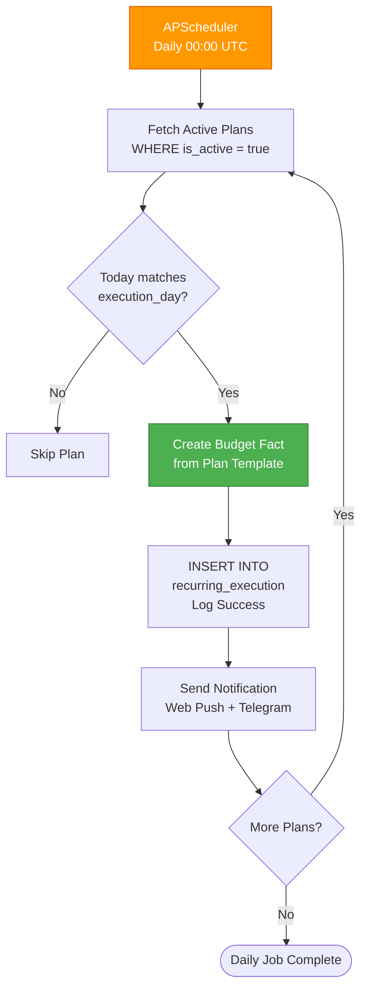
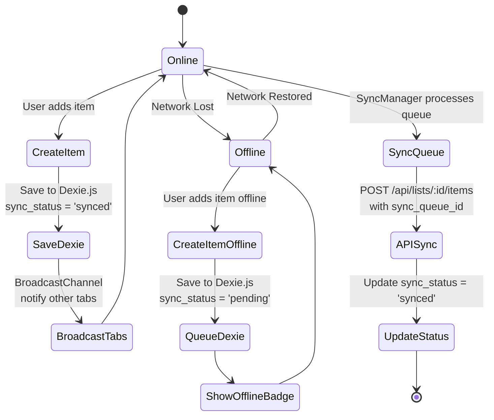

# Features Integration Map

**Type**: Feature Interaction Diagram
**Purpose**: Cross-module feature dependencies and interactions
**Last Updated**: 2026-02-07

## Feature Dependencies



---

## Transfers System Flow



---

## Recurring Plans Execution



### MMDD Encoding

```
execution_day = 531  // May 31st
execution_day = 229  // Feb 29th (leap year only)
execution_day = 101  // Jan 1st
```

---

## Shopping Lists Offline Sync



---

## References

- [Transfers System](../architecture/features/transfers-system.md)
- [Recurring Plans](../architecture/features/recurring-plans.md)
- [Shopping Lists](../architecture/features/shopping-lists.md)
- [Offline Sync](09-offline-architecture.md)

---

**Version**: 11.4.4
**Created**: 2026-02-07
