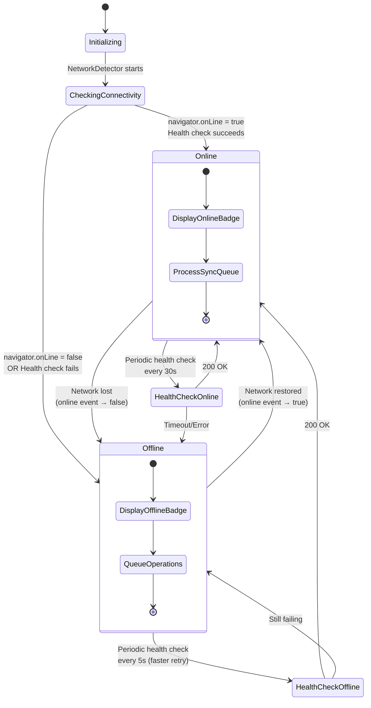
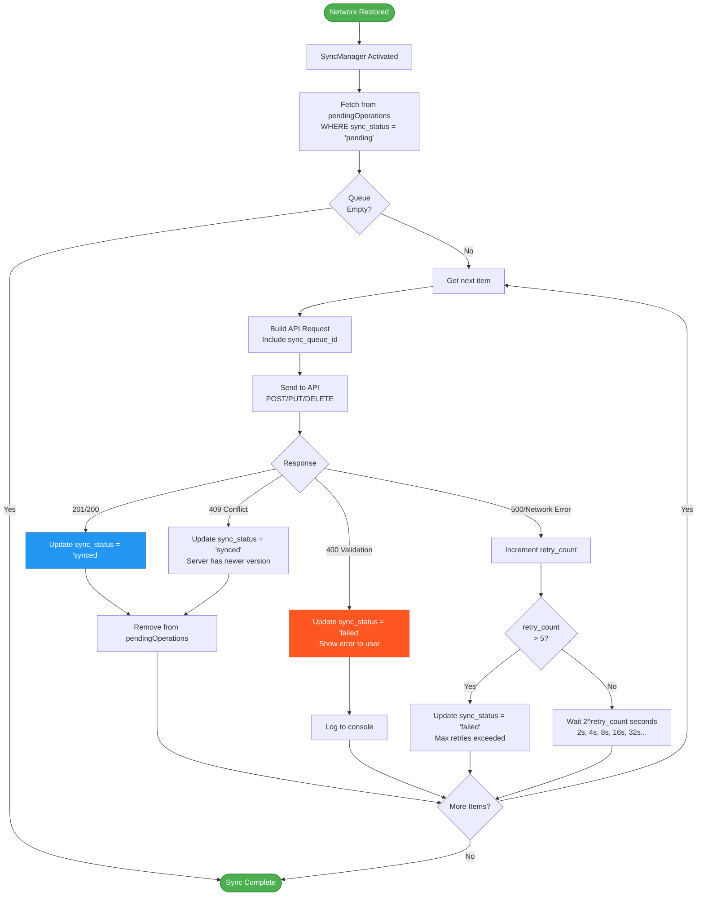
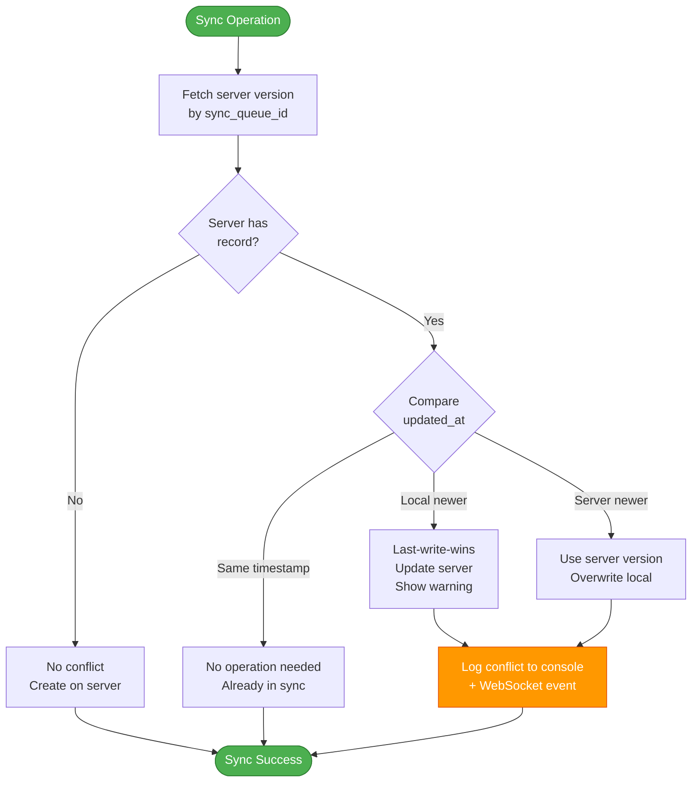
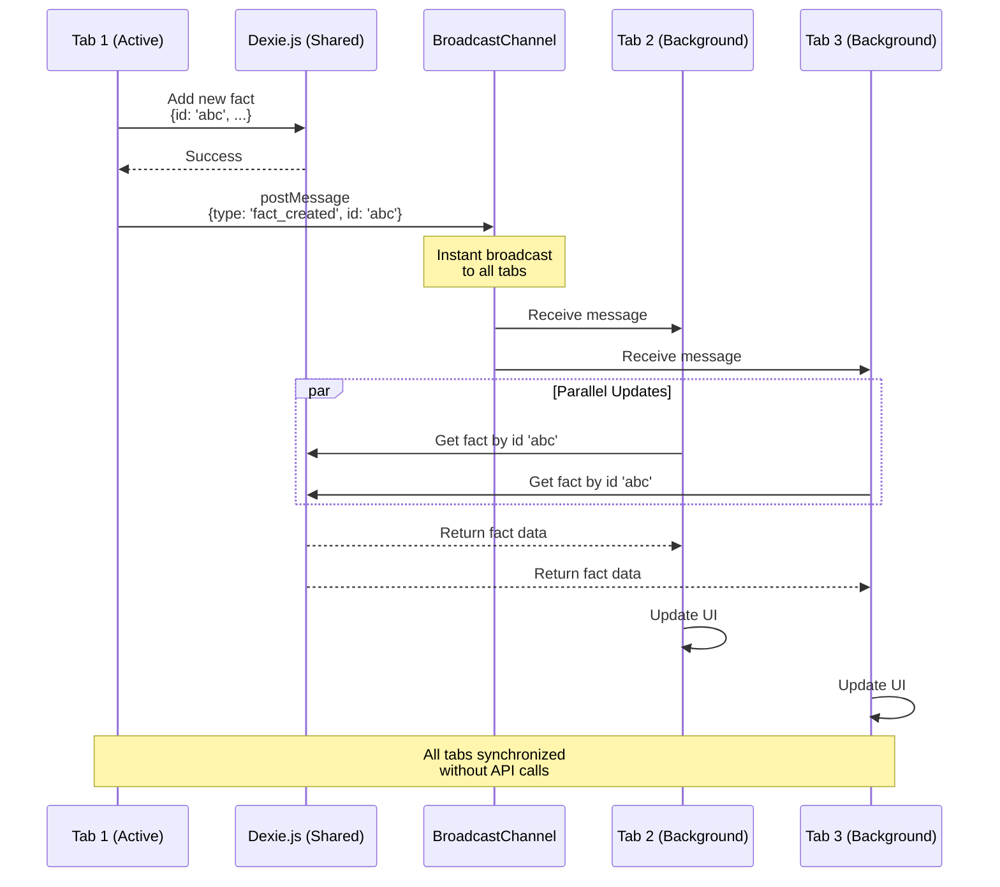
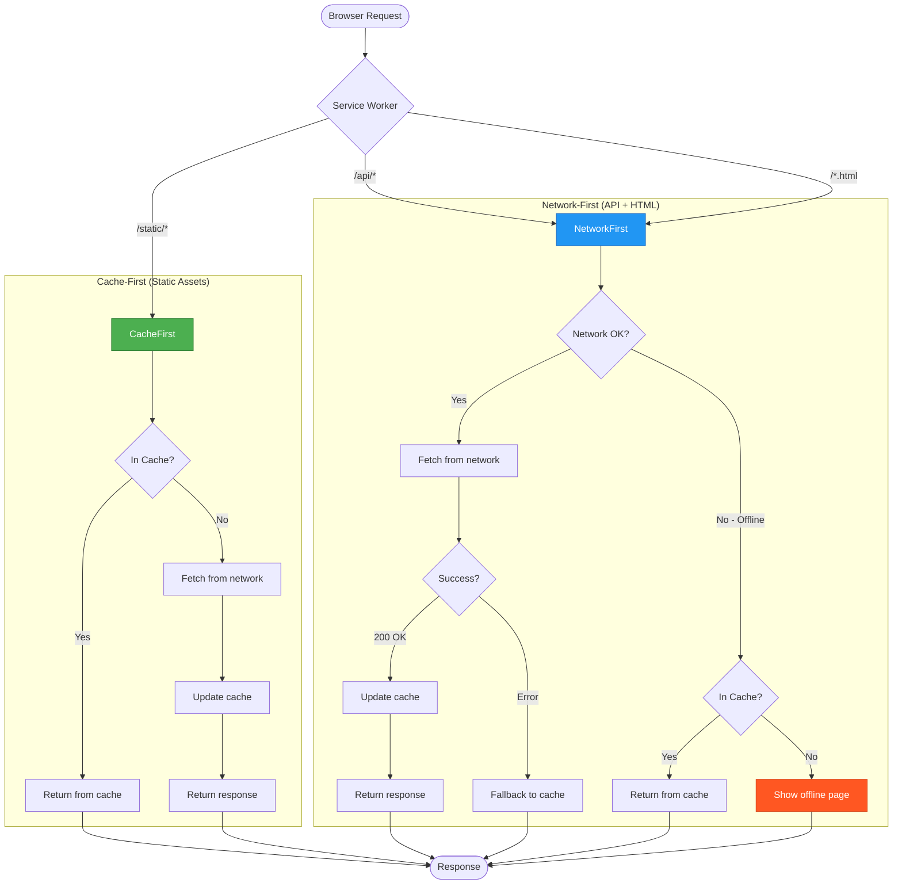
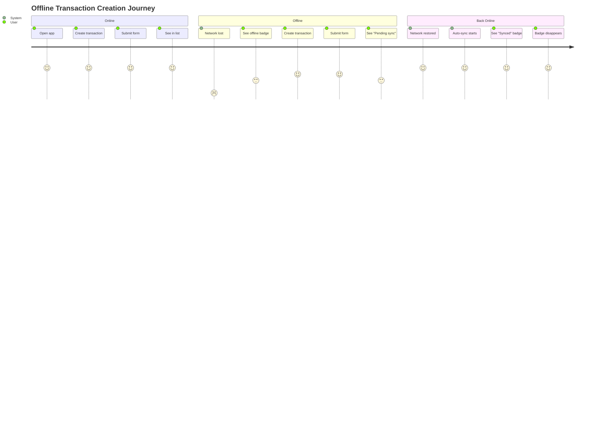

# Offline Architecture

**Type**: State Machine + Flow Diagram
**Purpose**: NetworkDetector, Dexie.js sync, conflict resolution
**Last Updated**: 2026-02-07

## Network State Machine



### Health Check Endpoint

```javascript
// networkDetector.ts
async function healthCheck(): Promise<boolean> {
    try {
        const response = await fetch('/api/health', {
            method: 'HEAD',
            cache: 'no-cache',
            signal: AbortSignal.timeout(5000) // 5s timeout
        });
        return response.ok;
    } catch {
        return false;
    }
}
```

---

## Dexie.js Schema (15 Tables)

```mermaid
erDiagram
    budgetFacts {
        bigint budget_fact_id PK
        string sync_queue_id UK
        bigint user_id
        date fact_date
        string sync_status "pending|synced|failed"
        bigint amount_cents "Stored in cents"
        timestamp created_at
    }

    articles {
        bigint article_id PK
        string article_name
        string article_category
        boolean is_active
    }

    articleHierarchy {
        bigint ancestor_id PK_FK
        bigint descendant_id PK_FK
        int depth
    }

    financialCenters {
        int financial_center_id PK
        string name
        boolean is_active
    }

    costCenters {
        int cost_center_id PK
        string name
        boolean is_active
    }

    pendingOperations {
        int id PK
        string sync_queue_id UK
        string operation "create|update|delete"
        string entity_type "fact|list|item"
        json payload
        int retry_count
        timestamp created_at
    }

    syncConflicts {
        int id PK
        string entity_type
        string entity_id
        string conflict_type
        json local_data
        json server_data
        timestamp created_at
    }

    recurringPlans {
        bigint recurring_plan_id PK
        bigint user_id
        bigint article_id FK
        boolean is_active
        int execution_day "MMDD encoding"
    }

    shoppingLists {
        bigint shopping_list_id PK
        string sync_queue_id UK
        bigint creator_id
        string name
        string sync_status "pending|synced|failed"
        timestamp created_at
    }

    shoppingListItems {
        bigint shopping_item_id PK
        string sync_queue_id UK
        bigint list_id FK
        string name
        boolean purchased
        string sync_status "pending|synced|failed"
    }

    stores {
        int store_id PK
        string name
    }

    productGroups {
        int product_group_id PK
        string name
    }

    productGroupHierarchy {
        int ancestor_id PK_FK
        int descendant_id PK_FK
        int depth
    }

    syncMetadata {
        string key PK
        json value
        timestamp last_synced_at
    }

    schemaMigrations {
        int id PK
        int version
        timestamp applied_at
    }

    articles ||--o{ articleHierarchy : "ancestor/descendant"
    shoppingLists ||--o{ shoppingListItems : "list_id"
    productGroups ||--o{ productGroupHierarchy : "ancestor/descendant"
    recurringPlans }o--|| articles : "article_id"
```



---

## Sync Queue Processing



---

## Conflict Resolution Logic



### Conflict Example

```javascript
// Local version (offline edit)
{
    id: 'abc123',
    amount_cents: 10000,
    updated_at: '2026-02-07T10:00:00Z'
}

// Server version (edited by another user)
{
    id: 'abc123',
    amount_cents: 15000,
    updated_at: '2026-02-07T10:05:00Z'  // Newer!
}

// Result: Server wins, local version overwritten
// User sees notification: "Transaction updated by another user"
```

---

## BroadcastChannel Multi-Tab Coordination



### Benefits

- **Zero latency**: Synchronous message passing
- **No server load**: Tabs share IndexedDB data
- **Offline compatible**: Works without network
- **Battery efficient**: No polling required

---

## Service Worker Caching Strategy



---

## Offline User Experience



---

## References

- [Offline Architecture](../architecture/core/pwa.md)
- [Dexie.js Integration](../architecture/core/dexie-integration.md)
- [Service Worker Caching](../architecture/optimization/caching-strategy.md)

---

**Version**: 11.4.4
**Created**: 2026-02-07
