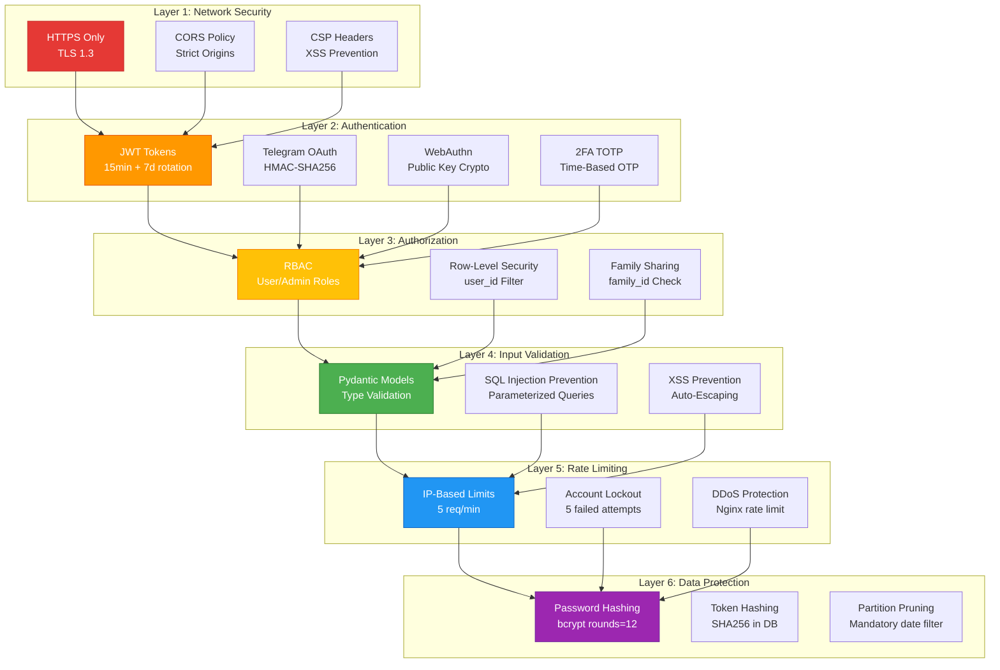
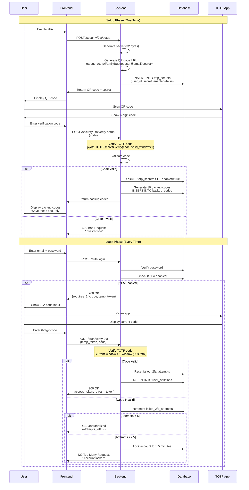
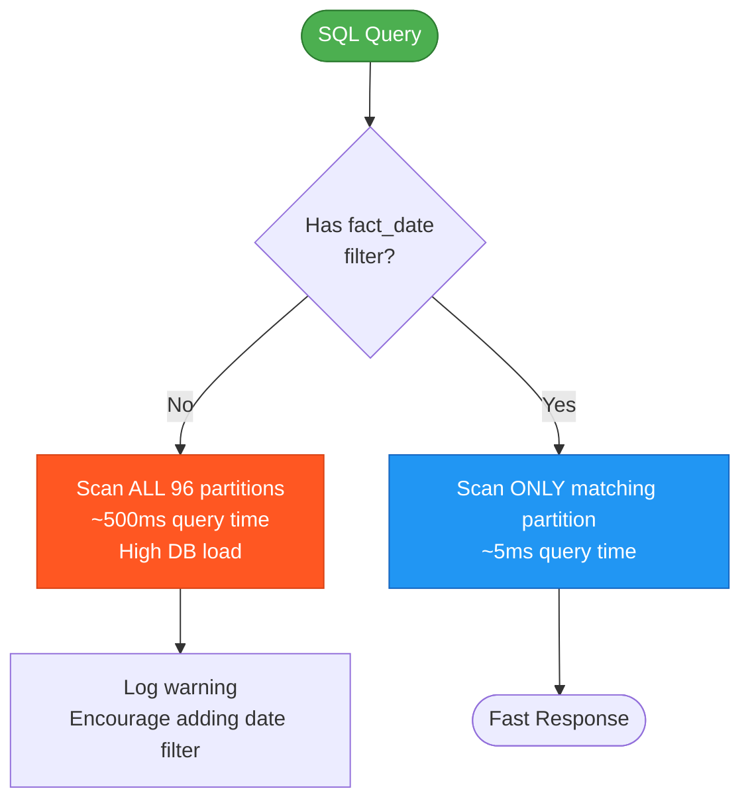

# Security Architecture

**Type**: Security Flow Diagram
**Purpose**: Authentication middleware, 2FA/WebAuthn flows, rate limiting
**Last Updated**: 2026-02-07

## Security Layers Overview



---

## JWT Middleware Flow

```mermaid
flowchart TB
    Request([API Request]) --> CheckPublic{Public<br/>Endpoint?}

    CheckPublic -->|Yes /auth/*| AllowPublic[Allow Access]
    CheckPublic -->|No| ExtractToken[Extract Authorization Header]

    ExtractToken --> TokenExists{Bearer Token<br/>Present?}
    TokenExists -->|No| Return401A[401 Unauthorized<br/>"Missing token"]

    TokenExists -->|Yes| DecodeJWT[Decode JWT]
    DecodeJWT --> ValidateSignature{Signature<br/>Valid?}

    ValidateSignature -->|No| Return401B[401 Unauthorized<br/>"Invalid signature"]
    ValidateSignature -->|Yes| CheckExpiration{Token<br/>Expired?}

    CheckExpiration -->|Yes| Return401C[401 Unauthorized<br/>"Token expired"]
    CheckExpiration -->|No| ExtractUserID[Extract user_id from token]

    ExtractUserID --> LoadUser[Load User from DB<br/>SELECT * WHERE user_id = ?]

    LoadUser --> UserExists{User<br/>Exists?}
    UserExists -->|No| Return401D[401 Unauthorized<br/>"User not found"]

    UserExists -->|Yes| CheckActive{User<br/>is_active?}
    CheckActive -->|No| Return403A[403 Forbidden<br/>"Account disabled"]

    CheckActive -->|Yes| CheckRole{Requires<br/>Admin?}
    CheckRole -->|No| AttachUser[Attach user to request<br/>request.state.user]
    CheckRole -->|Yes| IsAdmin{User role<br/>== admin?}

    IsAdmin -->|No| Return403B[403 Forbidden<br/>"Admin required"]
    IsAdmin -->|Yes| AttachUser

    AttachUser --> NextMiddleware([Continue to Endpoint])

    AllowPublic --> NextMiddleware

    style Request fill:#4CAF50,stroke:#2E7D32,color:#fff
    style NextMiddleware fill:#4CAF50,stroke:#2E7D32,color:#fff
    style Return401A fill:#FF5722,stroke:#D84315,color:#fff
    style Return403A fill:#FF9800,stroke:#E65100,color:#fff
```

---

## 2FA Flow (TOTP)



### Backup Codes

```python
# Generate 10 single-use backup codes
backup_codes = [
    secrets.token_hex(8)  # e.g., "a3f9d2c1b4e8f7a6"
    for _ in range(10)
]

# Hash before storing
hashed_codes = [
    hashlib.sha256(code.encode()).hexdigest()
    for code in backup_codes
]

# User can use backup code instead of TOTP
# After use, mark as used (cannot reuse)
```

---

## WebAuthn Security Flow

```mermaid
flowchart TB
    Start([User initiates login]) --> Challenge[Server generates challenge<br/>32 random bytes]

    Challenge --> StoreChallenge[Store in webauthn_challenges<br/>expires_at = now + 5min]

    StoreChallenge --> SendClient[Send challenge to client<br/>+ allowed credentials]

    SendClient --> UserPrompt[Browser prompts biometric<br/>Touch ID / Face ID / YubiKey]

    UserPrompt --> Biometric{Biometric<br/>Valid?}

    Biometric -->|No| Fail[Authentication Failed]
    Biometric -->|Yes| SignChallenge[Authenticator signs challenge<br/>with private key]

    SignChallenge --> SendAssertion[Send assertion to server<br/>{credentialId, signature, authenticatorData}]

    SendAssertion --> VerifyChallenge{Challenge<br/>matches?}
    VerifyChallenge -->|No| Fail

    VerifyChallenge -->|Yes| VerifyOrigin{Origin<br/>matches RP ID?}
    VerifyOrigin -->|No| Fail

    VerifyOrigin -->|Yes| LoadCredential[Load public key from DB<br/>WHERE credential_id = ?]

    LoadCredential --> VerifySignature{Signature valid<br/>with public key?}
    VerifySignature -->|No| Fail

    VerifySignature -->|Yes| VerifyCounter{Counter ><br/>stored counter?}
    VerifyCounter -->|No - Replay| Fail

    VerifyCounter -->|Yes| UpdateCounter[Update stored counter<br/>Prevent replay attacks]

    UpdateCounter --> CreateSession[Create JWT tokens<br/>Generate session]

    CreateSession --> Success([Authentication Success])

    style Start fill:#4CAF50,stroke:#2E7D32,color:#fff
    style Success fill:#4CAF50,stroke:#2E7D32,color:#fff
    style Fail fill:#FF5722,stroke:#D84315,color:#fff
    style VerifySignature fill:#2196F3,stroke:#1565C0,color:#fff
```

### Security Properties

| Property | Protection Against |
|----------|-------------------|
| **Challenge-Response** | Replay attacks |
| **Public Key Crypto** | Credential theft (private key never leaves device) |
| **Counter Validation** | Cloned authenticators |
| **Origin Validation** | Phishing attacks |
| **User Presence** | Unauthorized access (requires biometric/PIN) |

---

## Rate Limiting Strategy

```mermaid
flowchart TB
    Request([API Request]) --> ExtractIP[Extract Client IP<br/>X-Forwarded-For or remote_addr]

    ExtractIP --> CheckRedis[Check Redis counter<br/>key: rate_limit:{ip}:{endpoint}]

    CheckRedis --> CounterExists{Counter<br/>Exists?}

    CounterExists -->|No| CreateCounter[Create counter = 1<br/>TTL = 60 seconds]
    CreateCounter --> AllowRequest

    CounterExists -->|Yes| IncrCounter[Increment counter]
    IncrCounter --> CheckLimit{Counter<br/>> 5?}

    CheckLimit -->|No| AllowRequest[Allow Request]
    CheckLimit -->|Yes| Return429[429 Too Many Requests<br/>Retry-After: 60]

    AllowRequest --> ProcessRequest([Process Request])

    style Request fill:#4CAF50,stroke:#2E7D32,color:#fff
    style ProcessRequest fill:#4CAF50,stroke:#2E7D32,color:#fff
    style Return429 fill:#FF5722,stroke:#D84315,color:#fff
```

### Rate Limits

| Endpoint | Limit | Window |
|----------|-------|--------|
| **/auth/login** | 5 attempts | 1 minute |
| **/auth/verify-2fa** | 5 attempts | 1 minute |
| **/api/budget/facts** | 100 requests | 1 minute |
| **/api/analytics/** | 20 requests | 1 minute |

---

## Partition Pruning Security



### Example

```sql
-- BAD: Scans 96 partitions
SELECT * FROM t_f_budget_fact WHERE user_id = 1;

-- GOOD: Scans 1 partition (February 2026)
SELECT * FROM t_f_budget_fact
WHERE user_id = 1
  AND fact_date >= '2026-02-01'
  AND fact_date < '2026-03-01';
```

**Enforcement**: API always adds date filter (current month) if not provided.

---

## Password Security

```mermaid
flowchart TB
    Registration([User registers]) --> ValidatePassword{Password<br/>meets criteria?}

    ValidatePassword -->|No| RejectWeak[400 Bad Request<br/>Min 8 chars, 1 uppercase, 1 digit]
    ValidatePassword -->|Yes| HashPassword[bcrypt.hashpw<br/>rounds=12]

    HashPassword --> StoreHash[Store hashed password<br/>NEVER store plaintext]

    StoreHash --> LoginAttempt([User attempts login])

    LoginAttempt --> FetchHash[Fetch hashed password<br/>FROM users WHERE email = ?]

    FetchHash --> CompareHash[bcrypt.checkpw<br/>Compare submitted vs stored]

    CompareHash --> Match{Passwords<br/>Match?}

    Match -->|No| IncrementFailed[Increment failed_login_attempts]
    IncrementFailed --> CheckAttempts{Attempts<br/>>= 5?}

    CheckAttempts -->|Yes| LockAccount[Lock account for 15 minutes<br/>UPDATE users SET locked_until = now + 15min]
    CheckAttempts -->|No| ReturnError[401 Unauthorized<br/>{attempts_left}]

    Match -->|Yes| ResetAttempts[Reset failed_login_attempts = 0]
    ResetAttempts --> Success([Login Success])

    style Registration fill:#4CAF50,stroke:#2E7D32,color:#fff
    style Success fill:#4CAF50,stroke:#2E7D32,color:#fff
    style LockAccount fill:#FF5722,stroke:#D84315,color:#fff
```

### bcrypt Parameters

- **Algorithm**: bcrypt
- **Rounds**: 12 (2^12 = 4096 iterations)
- **Salt**: Automatically generated per password
- **Time**: ~200ms per hash (intentional slowdown)

---

## Security Best Practices Checklist

- ✅ HTTPS enforced (HSTS headers)
- ✅ CORS restricted to known origins
- ✅ CSP headers prevent XSS
- ✅ JWT tokens with short expiration
- ✅ Refresh token rotation
- ✅ Password hashing with bcrypt
- ✅ 2FA support (TOTP)
- ✅ WebAuthn biometric authentication
- ✅ Rate limiting on auth endpoints
- ✅ Account lockout after failed attempts
- ✅ SQL injection prevention (parameterized queries)
- ✅ XSS prevention (template auto-escaping)
- ✅ CSRF protection (SameSite cookies)
- ✅ Input validation (Pydantic models)
- ✅ Partition pruning enforcement

---

## References

- [Authentication Architecture](../architecture/core/authentication.md)
- [JWT Implementation](../architecture/backend/endpoints/auth.md)
- [2FA Setup](../architecture/features/two-factor-auth.md)
- [WebAuthn Implementation](../architecture/features/webauthn.md)

---

**Version**: 11.4.4
**Created**: 2026-02-07
