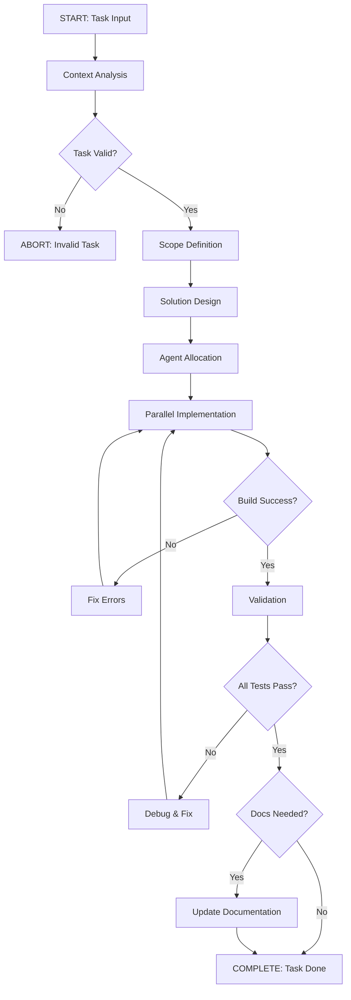

# Schema-Guided Reasoning Template для Family Budget

## 🎯 Структурированная схема решения задач

<schema_metadata>
version: "1.0.0"
template_type: "sgr-workflow"
domain: "family-budget-development"
enforcement_level: "strict"
</schema_metadata>

<reasoning_schema>
```yaml
name: FamilyBudgetTaskProcessor
description: Структурированный процесс решения задач в Family Budget
mandatory_steps: true
allow_backtracking: true
parallel_execution: enabled

steps:
  - id: context_analysis
    type: mandatory
    description: "Анализ контекста и классификация задачи"
    
  - id: scope_definition
    type: mandatory
    description: "Определение границ и влияния изменений"
    
  - id: solution_design
    type: mandatory
    description: "Проектирование решения с учетом ограничений"
    
  - id: agent_allocation
    type: mandatory
    description: "Распределение задач между специализированными агентами"
    
  - id: implementation
    type: mandatory
    description: "Реализация с параллельной обработкой"
    
  - id: validation
    type: mandatory
    description: "Многоуровневая валидация результатов"
    
  - id: documentation
    type: conditional
    condition: "changes_affect_api OR new_feature"
    description: "Обновление документации"
```
</reasoning_schema>

## 📋 ВХОДНЫЕ ПАРАМЕТРЫ (заполнить перед выполнением)

<task_input>
```yaml
task:
  type: [bug_fix | feature | optimization | refactoring | investigation]
  priority: [critical | high | medium | low]
  url: "[страница или endpoint]"
  description: "[детальное описание]"
  screenshots: "[путь к скриншотам]"
  
current_behavior:
  description: "[как работает сейчас]"
  error_messages: []
  affected_users: [all | specific_roles | single_user]
  
expected_behavior:
  description: "[как должно работать]"
  acceptance_criteria: []
  performance_requirements: []
  
technical_context:
  affected_components: [frontend | backend | database | infrastructure]
  related_tickets: []
  dependencies: []
```
</task_input>

## 🔍 STEP 1: CONTEXT ANALYSIS (Обязательный)

<reasoning_step id="context_analysis">
```yaml
inputs:
  - task_input.task
  - task_input.current_behavior
  - system_architecture

outputs:
  task_classification:
    category: [определить тип задачи]
    complexity: [simple | moderate | complex]
    risk_level: [low | medium | high]
    
  affected_layers:
    frontend: [true/false]
    backend: [true/false]
    database: [true/false]
    infrastructure: [true/false]
    
  required_expertise:
    - [список необходимых специализаций]

validation_checkpoint:
  - "Тип задачи корректно определен?"
  - "Все затронутые компоненты идентифицированы?"
  - "Риски оценены адекватно?"
```

### Исполнение:
1. Использовать `Grep` для поиска упоминаний компонента/функции
2. Читать связанные файлы через `Read`
3. Проверить логи контейнеров если есть ошибки
4. Определить паттерны похожих решений в кодовой базе

</reasoning_step>

## 🎯 STEP 2: SCOPE DEFINITION (Обязательный)

<reasoning_step id="scope_definition">
```yaml
inputs:
  - context_analysis.outputs
  - task_input.expected_behavior

outputs:
  change_scope:
    files_to_modify: []
    new_files: []
    deprecated_files: []
    
  impact_analysis:
    breaking_changes: [true/false]
    migration_required: [true/false]
    backward_compatible: [true/false]
    
  test_scope:
    unit_tests_required: []
    integration_tests_required: []
    e2e_tests_required: []

validation_checkpoint:
  - "Все файлы для изменения определены?"
  - "Влияние на API документировано?"
  - "Тестовое покрытие спланировано?"
```

### Исполнение:
1. Создать граф зависимостей между компонентами
2. Определить минимальный набор изменений
3. Оценить влияние на производительность
4. Проверить необходимость миграций БД

</reasoning_step>

## 🏗️ STEP 3: SOLUTION DESIGN (Обязательный)

<reasoning_step id="solution_design">
```yaml
inputs:
  - scope_definition.outputs
  - technical_constraints

outputs:
  solution_architecture:
    approach: "[описание подхода]"
    patterns_to_use: []
    anti_patterns_to_avoid: []
    
  implementation_plan:
    phases: []
    parallelizable_tasks: []
    sequential_dependencies: []
    
  resource_allocation:
    estimated_time: "[время в часах]"
    required_agents: []
    docker_containers: []

validation_checkpoint:
  - "Решение соответствует архитектуре проекта?"
  - "Учтены все технические ограничения?"
  - "План реалистичен по времени?"
```

### Исполнение:
1. Использовать `TodoWrite` для создания детального плана
2. Определить параллельные и последовательные задачи
3. Выбрать оптимальные паттерны из существующего кода
4. Проверить совместимость с текущими версиями зависимостей

</reasoning_step>

## 👥 STEP 4: AGENT ALLOCATION (Обязательный)

<reasoning_step id="agent_allocation">
```yaml
inputs:
  - solution_design.implementation_plan
  - solution_design.resource_allocation

outputs:
  agent_assignments:
    - agent: api-developer
      tasks: []
      priority: [1-5]
      
    - agent: frontend-developer
      tasks: []
      priority: [1-5]
      
    - agent: database-designer
      tasks: []
      priority: [1-5]
      
    - agent: test-engineer
      tasks: []
      priority: [1-5]
      
  execution_strategy:
    parallel_tracks: []
    synchronization_points: []
    
validation_checkpoint:
  - "Каждая задача назначена подходящему агенту?"
  - "Нет конфликтов в параллельном выполнении?"
  - "Критические задачи приоритизированы?"
```

### Матрица специализаций агентов:
```yaml
agent_specializations:
  api-developer: [REST endpoints, OpenAPI, validation, serialization]
  frontend-developer: [Svelte components, UI/UX, state management]
  backend-developer: [business logic, services, data processing]
  database-designer: [schema, indexes, queries, migrations]
  typescript-developer: [types, interfaces, generics]
  docker-deployment-expert: [containers, networks, volumes]
  test-engineer: [unit tests, integration, coverage]
  code-documenter: [API docs, comments, ADR]
  code-security-auditor: [vulnerabilities, data isolation, auth]
```

</reasoning_step>

## ⚙️ STEP 5: IMPLEMENTATION (Обязательный)

<reasoning_step id="implementation">
```yaml
inputs:
  - agent_allocation.outputs
  - scope_definition.change_scope

parallel_execution_tracks:
  track_a_backend:
    agents: [api-developer, backend-developer]
    tasks: []
    container: budget-backend
    
  track_b_frontend:
    agents: [frontend-developer, typescript-developer]
    tasks: []
    container: budget-frontend
    
  track_c_database:
    agents: [database-designer]
    tasks: []
    container: budget-postgres
    
synchronization_barriers:
  - after: "API schema changes"
    wait_for: ["frontend types update"]
    
  - after: "Database migration"
    wait_for: ["backend model update", "frontend API client update"]

outputs:
  completed_changes:
    modified_files: []
    new_files: []
    deleted_files: []
    
  build_status:
    backend: [success/failure]
    frontend: [success/failure]
    
validation_checkpoint:
  - "Все изменения применены через Docker exec?"
  - "Использован MultiEdit для batch операций?"
  - "Контейнеры перезапущены корректно?"
```

### Правила выполнения:
1. **ОБЯЗАТЕЛЬНО** все команды через `docker exec budget-*`
2. **ЗАПРЕЩЕНО** запускать npm/pip на хосте
3. **ИСПОЛЬЗОВАТЬ** MultiEdit для пакетных изменений
4. **ПРОВЕРЯТЬ** изоляцию данных по user_id

</reasoning_step>

## ✅ STEP 6: VALIDATION (Обязательный)

<reasoning_step id="validation">
```yaml
inputs:
  - implementation.outputs
  - test_scope

validation_matrix:
  functional_tests:
    unit_tests:
      command: "docker exec budget-backend python -m pytest"
      required_coverage: 80
      status: [pass/fail]
      
    integration_tests:
      command: "docker exec budget-backend python -m pytest tests/integration/"
      status: [pass/fail]
      
  type_checking:
    backend:
      command: "docker exec budget-backend mypy app/"
      status: [pass/fail]
      
    frontend:
      command: "docker exec budget-frontend npm run check"
      status: [pass/fail]
      
  security_validation:
    data_isolation:
      command: "docker exec budget-backend python scripts/check-data-isolation.py"
      status: [pass/fail]
      
    dependency_audit:
      command: "docker exec budget-frontend npm audit"
      status: [pass/fail]
      
  performance_check:
    api_response_time: [value_ms]
    database_query_time: [value_ms]
    frontend_build_size: [value_kb]

outputs:
  validation_report:
    all_tests_passed: [true/false]
    coverage_percentage: [number]
    security_issues: []
    performance_regression: [true/false]
    
validation_checkpoint:
  - "Все тесты зеленые?"
  - "Покрытие ≥ 80%?"
  - "Нет регрессий производительности?"
  - "Изоляция данных соблюдена?"
```

### Критерии успешной валидации:
- ✅ Все unit тесты проходят
- ✅ Type checking без ошибок
- ✅ Security audit чистый
- ✅ Производительность не деградировала
- ✅ Документация актуальна

</reasoning_step>

## 📚 STEP 7: DOCUMENTATION (Условный)

<reasoning_step id="documentation" condition="changes_affect_api OR new_feature">
```yaml
inputs:
  - implementation.completed_changes
  - validation.validation_report

documentation_tasks:
  api_documentation:
    agent: code-documenter
    files: ["/docs/api/endpoints.md"]
    auto_generate: "docker exec budget-backend python scripts/generate-api-docs.py"
    
  component_documentation:
    agent: code-documenter
    files: ["/docs/components/*.md"]
    auto_generate: "docker exec budget-frontend npm run docs:generate"
    
  architecture_decision:
    template: "/docs/templates/architecture-decision.md"
    output: "/docs/architecture/adr-XXX-[name].md"
    
outputs:
  documentation_status:
    api_docs_updated: [true/false]
    component_docs_updated: [true/false]
    adr_created: [true/false]
    
validation_checkpoint:
  - "API документация синхронизирована?"
  - "Примеры использования добавлены?"
  - "ADR создан для архитектурных изменений?"
```
</reasoning_step>

## 🎬 EXECUTION CONTROL FLOW

<execution_flow>

</execution_flow>

## 🚀 EFFICIENCY OPTIMIZATIONS

<performance_rules>
```yaml
batch_operations:
  - USE: MultiEdit for multiple changes in same file
  - USE: Parallel agent execution for independent tasks
  - USE: Single docker exec for multiple commands (with &&)
  - AVOID: Sequential file reads when batch read possible
  - AVOID: Multiple small commits, batch related changes

context_management:
  - PRELOAD: Related files at start of analysis
  - CACHE: Frequently accessed configurations
  - MINIMIZE: Context switches between different layers
  - CLEANUP: Close unused background processes

token_efficiency:
  - PREFER: Structured outputs over verbose explanations
  - USE: Code blocks only when necessary
  - COMPRESS: Repetitive patterns into functions
  - SKIP: Unnecessary confirmations and summaries
```
</performance_rules>

## 📊 QUALITY GATES

<quality_gates>
```yaml
mandatory_checks:
  pre_commit:
    - test_coverage: "≥ 80%"
    - type_checking: "zero errors"
    - linting: "zero errors"
    - security_audit: "no high/critical issues"
    
  pre_merge:
    - all_tests_passing: true
    - documentation_updated: true
    - code_review_approved: true
    - performance_baseline_met: true
    
automated_rollback:
  triggers:
    - test_failure_rate: "> 10%"
    - performance_degradation: "> 20%"
    - security_vulnerability: "critical"
```
</quality_gates>

## 🔄 FEEDBACK LOOP

<continuous_improvement>
```yaml
metrics_collection:
  - task_completion_time
  - defect_escape_rate
  - code_coverage_trend
  - performance_metrics
  
retrospective_triggers:
  - after_major_feature
  - after_critical_bug
  - weekly_scheduled
  
improvement_actions:
  - update_reasoning_schema
  - refine_agent_specializations
  - optimize_parallel_execution
  - enhance_validation_rules
```
</continuous_improvement>

---

## 💡 ИСПОЛЬЗОВАНИЕ ШАБЛОНА

1. **Заполните** секцию `task_input` с параметрами вашей задачи
2. **Следуйте** пошаговой схеме reasoning_schema
3. **Выполняйте** validation_checkpoint на каждом шаге
4. **Используйте** специализированных агентов согласно матрице
5. **Проверяйте** quality gates перед завершением

Этот шаблон обеспечивает:
- ✅ Структурированный подход к решению задач
- ✅ Предсказуемые и воспроизводимые результаты
- ✅ Параллельное выполнение для эффективности
- ✅ Встроенные проверки качества
- ✅ Автоматическую документацию изменений

**Schema Version**: 1.0.0
**Last Updated**: 2025-09-10
**Compatibility**: Family Budget Project